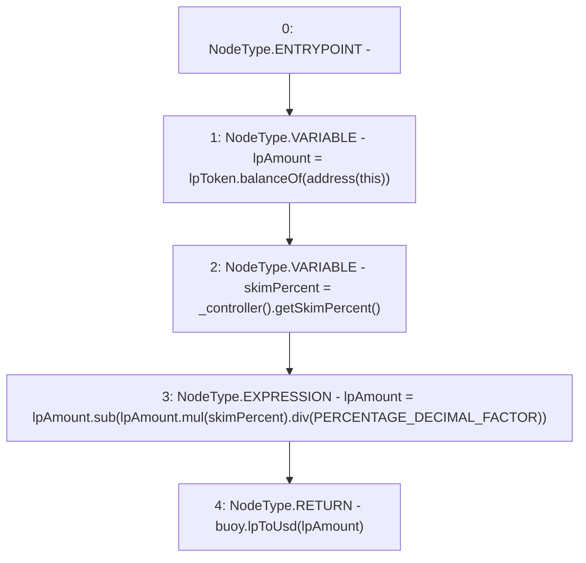

# Context: LifeGuard3Pool.availableUsd

**Contract:** `LifeGuard3Pool` (Inherits: FixedStablecoins, Constants, Whitelist, Controllable, Ownable, Context, ILifeGuard)
**Signature:** `availableUsd() returns (uint256)`
**Method Selector ID:** `0x996441db`
**Visibility:** `external`
**Environment-Free:** `Yes`
**Modifiers:** None

### State Variables Interaction
- **Reads:** PERCENTAGE_DECIMAL_FACTOR, buoy, lpToken
- **Writes:** None

### Environment & Verification Flags
- **Uses Foundry Cheatcodes:** No
- **Has Echidna Properties:** No

### Internal Calls Tree
- None

### External Calls / Value Transfers
- `IController.TMP_351(uint256) = HIGH_LEVEL_CALL, dest:TMP_350(IController), function:getSkimPercent, arguments:[]  `
- `SafeMath.TMP_354(uint256) = LIBRARY_CALL, dest:SafeMath, function:SafeMath.sub(uint256,uint256), arguments:['lpAmount', 'TMP_353'] `
- `IBuoy.TMP_355(uint256) = HIGH_LEVEL_CALL, dest:buoy(IBuoy), function:lpToUsd, arguments:['lpAmount']  `
- `SafeMath.TMP_353(uint256) = LIBRARY_CALL, dest:SafeMath, function:SafeMath.div(uint256,uint256), arguments:['TMP_352', 'PERCENTAGE_DECIMAL_FACTOR'] `
- `SafeMath.TMP_352(uint256) = LIBRARY_CALL, dest:SafeMath, function:SafeMath.mul(uint256,uint256), arguments:['lpAmount', 'skimPercent'] `
- `IERC20.TMP_349(uint256) = HIGH_LEVEL_CALL, dest:lpToken(IERC20), function:balanceOf, arguments:['TMP_348']  `

### Control Flow Graph (CFG)


### Source Mapping
Declared in: `certora-ac-datasets/detasets/web3bugs/dataset/web3bugs/17/contracts/pools/LifeGuard3Pool.sol` on lines **356** to **361**

```solidity
    function availableUsd() external view override returns (uint256) {
        uint256 lpAmount = lpToken.balanceOf(address(this));
        uint256 skimPercent = _controller().getSkimPercent();
        lpAmount = lpAmount.sub(lpAmount.mul(skimPercent).div(PERCENTAGE_DECIMAL_FACTOR));
        return buoy.lpToUsd(lpAmount);
    }

```
