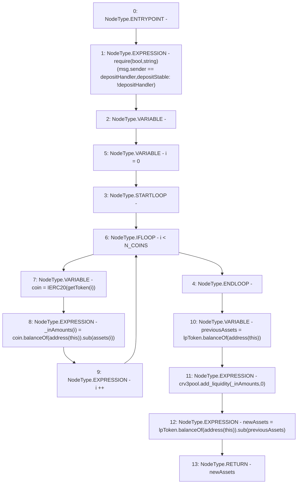

# Context: LifeGuard3Pool.deposit

**Contract:** `LifeGuard3Pool` (Inherits: FixedStablecoins, Constants, Whitelist, Controllable, Ownable, Context, ILifeGuard)
**Signature:** `deposit() returns (uint256)`
**Method Selector ID:** `0xd0e30db0`
**Visibility:** `external`
**Environment-Free:** `No (reads EVM state context)`
**Modifiers:** None

### State Variables Interaction
- **Reads:** N_COINS, assets, crv3pool, depositHandler, lpToken
- **Writes:** None

### Assertion Checks & Business Requirements
- require/assert: `require(bool,string)(msg.sender == depositHandler,depositStable: !depositHandler)`

### Environment & Verification Flags
- **Uses Foundry Cheatcodes:** No
- **Has Echidna Properties:** No

### Internal Calls Tree
- None

### External Calls / Value Transfers
- `IERC20.TMP_254(uint256) = HIGH_LEVEL_CALL, dest:lpToken(IERC20), function:balanceOf, arguments:['TMP_253']  `
- `SafeMath.TMP_248(uint256) = LIBRARY_CALL, dest:SafeMath, function:SafeMath.sub(uint256,uint256), arguments:['TMP_247', 'REF_80'] `
- `IERC20.TMP_247(uint256) = HIGH_LEVEL_CALL, dest:coin(IERC20), function:balanceOf, arguments:['TMP_246']  `
- `IERC20.TMP_251(uint256) = HIGH_LEVEL_CALL, dest:lpToken(IERC20), function:balanceOf, arguments:['TMP_250']  `
- `ICurve3Deposit.HIGH_LEVEL_CALL, dest:crv3pool(ICurve3Deposit), function:add_liquidity, arguments:['_inAmounts', '0']  `
- `SafeMath.TMP_255(uint256) = LIBRARY_CALL, dest:SafeMath, function:SafeMath.sub(uint256,uint256), arguments:['TMP_254', 'previousAssets'] `

### Control Flow Graph (CFG)


### Source Mapping
Declared in: `certora-ac-datasets/detasets/web3bugs/dataset/web3bugs/17/contracts/pools/LifeGuard3Pool.sol` on lines **197** to **207**

```solidity
    function deposit() external override returns (uint256 newAssets) {
        require(msg.sender == depositHandler, "depositStable: !depositHandler");
        uint256[N_COINS] memory _inAmounts;
        for (uint256 i = 0; i < N_COINS; i++) {
            IERC20 coin = IERC20(getToken(i));
            _inAmounts[i] = coin.balanceOf(address(this)).sub(assets[i]);
        }
        uint256 previousAssets = lpToken.balanceOf(address(this));
        crv3pool.add_liquidity(_inAmounts, 0);
        newAssets = lpToken.balanceOf(address(this)).sub(previousAssets);
    }

```
