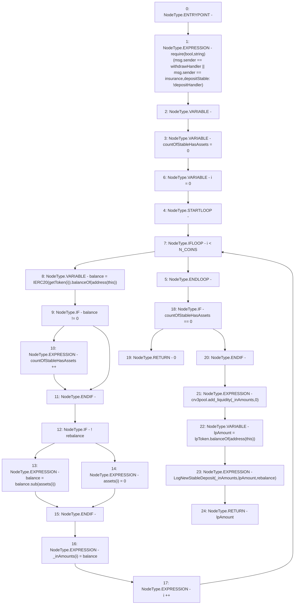

# Context: LifeGuard3Pool.depositStable

**Contract:** `LifeGuard3Pool` (Inherits: FixedStablecoins, Constants, Whitelist, Controllable, Ownable, Context, ILifeGuard)
**Signature:** `depositStable(bool) returns (uint256)`
**Method Selector ID:** `0xe2e5b1dd`
**Visibility:** `external`
**Environment-Free:** `No (reads EVM state context)`
**Modifiers:** None

### State Variables Interaction
- **Reads:** N_COINS, assets, crv3pool, insurance, lpToken, withdrawHandler
- **Writes:** assets

### Assertion Checks & Business Requirements
- require/assert: `require(bool,string)(msg.sender == withdrawHandler || msg.sender == insurance,depositStable: !depositHandler)`

### Environment & Verification Flags
- **Uses Foundry Cheatcodes:** No
- **Has Echidna Properties:** No

### Internal Calls Tree
- None

### External Calls / Value Transfers
- `SafeMath.TMP_228(uint256) = LIBRARY_CALL, dest:SafeMath, function:SafeMath.sub(uint256,uint256), arguments:['balance', 'REF_65'] `
- `ICurve3Deposit.HIGH_LEVEL_CALL, dest:crv3pool(ICurve3Deposit), function:add_liquidity, arguments:['_inAmounts', '0']  `
- `IERC20.TMP_224(uint256) = HIGH_LEVEL_CALL, dest:TMP_222(IERC20), function:balanceOf, arguments:['TMP_223']  `
- `IERC20.TMP_233(uint256) = HIGH_LEVEL_CALL, dest:lpToken(IERC20), function:balanceOf, arguments:['TMP_232']  `

### Control Flow Graph (CFG)


### Source Mapping
Declared in: `certora-ac-datasets/detasets/web3bugs/dataset/web3bugs/17/contracts/pools/LifeGuard3Pool.sol` on lines **161** to **182**

```solidity
    function depositStable(bool rebalance) external override returns (uint256) {
        require(msg.sender == withdrawHandler || msg.sender == insurance, "depositStable: !depositHandler");
        uint256[N_COINS] memory _inAmounts;
        uint256 countOfStableHasAssets = 0;
        for (uint256 i = 0; i < N_COINS; i++) {
            uint256 balance = IERC20(getToken(i)).balanceOf(address(this));
            if (balance != 0) {
                countOfStableHasAssets++;
            }
            if (!rebalance) {
                balance = balance.sub(assets[i]);
            } else {
                assets[i] = 0;
            }
            _inAmounts[i] = balance;
        }
        if (countOfStableHasAssets == 0) return 0;
        crv3pool.add_liquidity(_inAmounts, 0);
        uint256 lpAmount = lpToken.balanceOf(address(this));
        emit LogNewStableDeposit(_inAmounts, lpAmount, rebalance);
        return lpAmount;
    }

```
