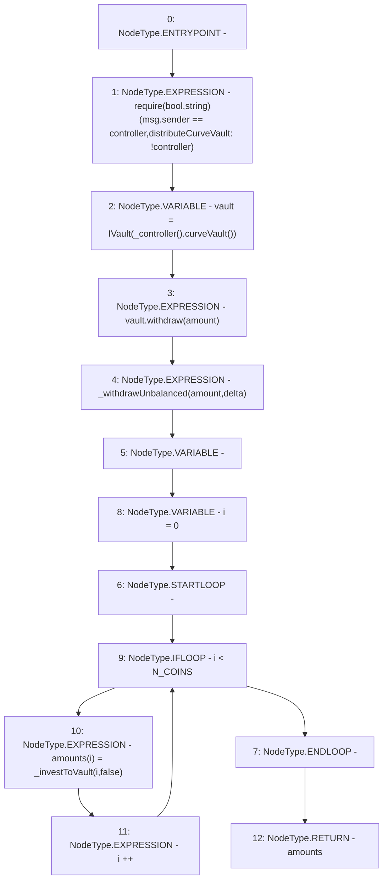

# Context: LifeGuard3Pool.distributeCurveVault

**Contract:** `LifeGuard3Pool` (Inherits: FixedStablecoins, Constants, Whitelist, Controllable, Ownable, Context, ILifeGuard)
**Signature:** `distributeCurveVault(uint256,uint256[3]) returns (uint256[3])`
**Method Selector ID:** `0x424c4026`
**Visibility:** `external`
**Environment-Free:** `No (reads EVM state context)`
**Modifiers:** None

### State Variables Interaction
- **Reads:** N_COINS, controller
- **Writes:** None

### Assertion Checks & Business Requirements
- require/assert: `require(bool,string)(msg.sender == controller,distributeCurveVault: !controller)`

### Environment & Verification Flags
- **Uses Foundry Cheatcodes:** No
- **Has Echidna Properties:** No

### Internal Calls Tree
- None

### External Calls / Value Transfers
- `IController.TMP_209(address) = HIGH_LEVEL_CALL, dest:TMP_208(IController), function:curveVault, arguments:[]  `
- `IVault.HIGH_LEVEL_CALL, dest:vault(IVault), function:withdraw, arguments:['amount']  `

### Control Flow Graph (CFG)


### Source Mapping
Declared in: `certora-ac-datasets/detasets/web3bugs/dataset/web3bugs/17/contracts/pools/LifeGuard3Pool.sol` on lines **142** to **157**

```solidity
    function distributeCurveVault(uint256 amount, uint256[N_COINS] memory delta)
        external
        override
        returns (uint256[N_COINS] memory)
    {
        require(msg.sender == controller, "distributeCurveVault: !controller");
        IVault vault = IVault(_controller().curveVault());

        vault.withdraw(amount);
        _withdrawUnbalanced(amount, delta);
        uint256[N_COINS] memory amounts;
        for (uint256 i = 0; i < N_COINS; i++) {
            amounts[i] = _investToVault(i, false);
        }
        return amounts;
    }

```
