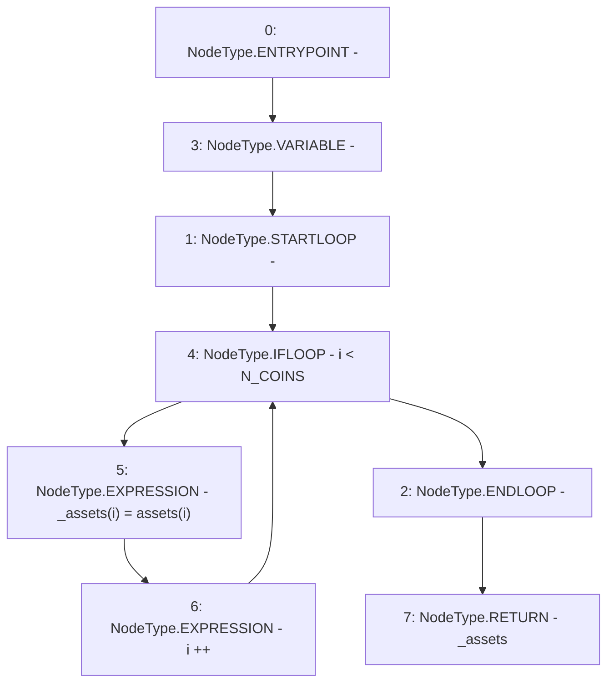

# Context: LifeGuard3Pool.getAssets

**Contract:** `LifeGuard3Pool` (Inherits: FixedStablecoins, Constants, Whitelist, Controllable, Ownable, Context, ILifeGuard)
**Signature:** `getAssets() returns (uint256[3])`
**Method Selector ID:** `0x67e4ac2c`
**Visibility:** `external`
**Environment-Free:** `Yes`
**Modifiers:** None

### State Variables Interaction
- **Reads:** N_COINS, assets
- **Writes:** None

### Environment & Verification Flags
- **Uses Foundry Cheatcodes:** No
- **Has Echidna Properties:** No

### Internal Calls Tree
- None

### External Calls / Value Transfers
- None

### Control Flow Graph (CFG)


### Source Mapping
Declared in: `certora-ac-datasets/detasets/web3bugs/dataset/web3bugs/17/contracts/pools/LifeGuard3Pool.sol` on lines **94** to **98**

```solidity
    function getAssets() external view override returns (uint256[N_COINS] memory _assets) {
        for (uint256 i; i < N_COINS; i++) {
            _assets[i] = assets[i];
        }
    }

```
