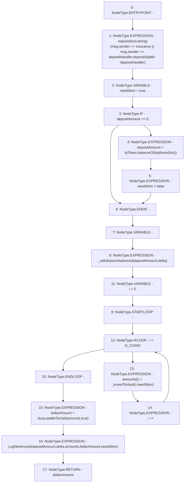

# Context: LifeGuard3Pool.invest

**Contract:** `LifeGuard3Pool` (Inherits: FixedStablecoins, Constants, Whitelist, Controllable, Ownable, Context, ILifeGuard)
**Signature:** `invest(uint256,uint256[3]) returns (uint256)`
**Method Selector ID:** `0xd7abd678`
**Visibility:** `external`
**Environment-Free:** `No (reads EVM state context)`
**Modifiers:** None

### State Variables Interaction
- **Reads:** N_COINS, buoy, depositHandler, insurance, lpToken
- **Writes:** None

### Assertion Checks & Business Requirements
- require/assert: `require(bool,string)(msg.sender == insurance || msg.sender == depositHandler,depositStable: !depositHandler)`

### Environment & Verification Flags
- **Uses Foundry Cheatcodes:** No
- **Has Echidna Properties:** No

### Internal Calls Tree
- None

### External Calls / Value Transfers
- `IBuoy.TMP_315(uint256) = HIGH_LEVEL_CALL, dest:buoy(IBuoy), function:stableToUsd, arguments:['amounts', 'True']  `
- `IERC20.TMP_310(uint256) = HIGH_LEVEL_CALL, dest:lpToken(IERC20), function:balanceOf, arguments:['TMP_309']  `

### Control Flow Graph (CFG)


### Source Mapping
Declared in: `certora-ac-datasets/detasets/web3bugs/dataset/web3bugs/17/contracts/pools/LifeGuard3Pool.sol` on lines **280** to **298**

```solidity
    function invest(uint256 depositAmount, uint256[N_COINS] calldata delta)
        external
        override
        returns (uint256 dollarAmount)
    {
        require(msg.sender == insurance || msg.sender == depositHandler, "depositStable: !depositHandler");
        bool needSkim = true;
        if (depositAmount == 0) {
            depositAmount = lpToken.balanceOf(address(this));
            needSkim = false;
        }
        uint256[N_COINS] memory amounts;
        _withdrawUnbalanced(depositAmount, delta);
        for (uint256 i = 0; i < N_COINS; i++) {
            amounts[i] = _investToVault(i, needSkim);
        }
        dollarAmount = buoy.stableToUsd(amounts, true);
        emit LogNewInvest(depositAmount, delta, amounts, dollarAmount, needSkim);
    }

```
