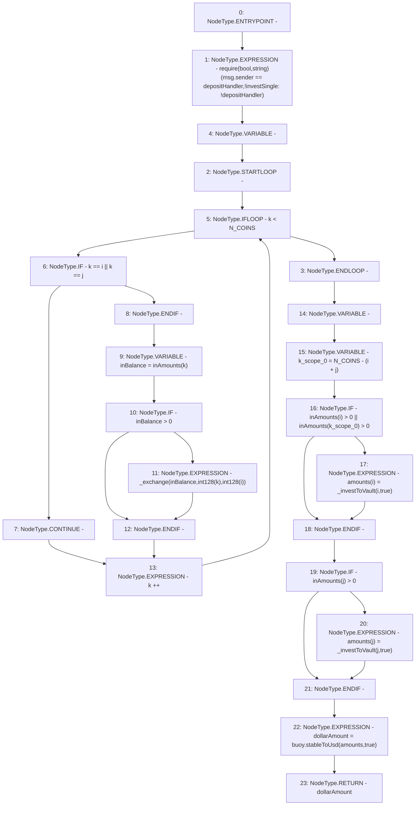

# Context: LifeGuard3Pool.investSingle

**Contract:** `LifeGuard3Pool` (Inherits: FixedStablecoins, Constants, Whitelist, Controllable, Ownable, Context, ILifeGuard)
**Signature:** `investSingle(uint256[3],uint256,uint256) returns (uint256)`
**Method Selector ID:** `0x63419a78`
**Visibility:** `external`
**Environment-Free:** `No (reads EVM state context)`
**Modifiers:** None

### State Variables Interaction
- **Reads:** N_COINS, buoy, depositHandler
- **Writes:** None

### Assertion Checks & Business Requirements
- require/assert: `require(bool,string)(msg.sender == depositHandler,!investSingle: !depositHandler)`

### Environment & Verification Flags
- **Uses Foundry Cheatcodes:** No
- **Has Echidna Properties:** No

### Internal Calls Tree
- None

### External Calls / Value Transfers
- `IBuoy.TMP_336(uint256) = HIGH_LEVEL_CALL, dest:buoy(IBuoy), function:stableToUsd, arguments:['amounts', 'True']  `

### Control Flow Graph (CFG)


### Source Mapping
Declared in: `certora-ac-datasets/detasets/web3bugs/dataset/web3bugs/17/contracts/pools/LifeGuard3Pool.sol` on lines **310** to **335**

```solidity
    function investSingle(
        uint256[N_COINS] calldata inAmounts,
        uint256 i,
        uint256 j
    ) external override returns (uint256 dollarAmount) {
        require(msg.sender == depositHandler, "!investSingle: !depositHandler");
        // Swap any additional stablecoins to target
        for (uint256 k; k < N_COINS; k++) {
            if (k == i || k == j) continue;
            uint256 inBalance = inAmounts[k];
            if (inBalance > 0) {
                _exchange(inBalance, int128(k), int128(i));
            }
        }
        uint256[N_COINS] memory amounts;

        uint256 k = N_COINS - (i + j);
        if (inAmounts[i] > 0 || inAmounts[k] > 0) {
            amounts[i] = _investToVault(i, true);
        }
        if (inAmounts[j] > 0) {
            amounts[j] = _investToVault(j, true);
        }
        // Assess USD value of new stablecoin amount
        dollarAmount = buoy.stableToUsd(amounts, true);
    }

```
