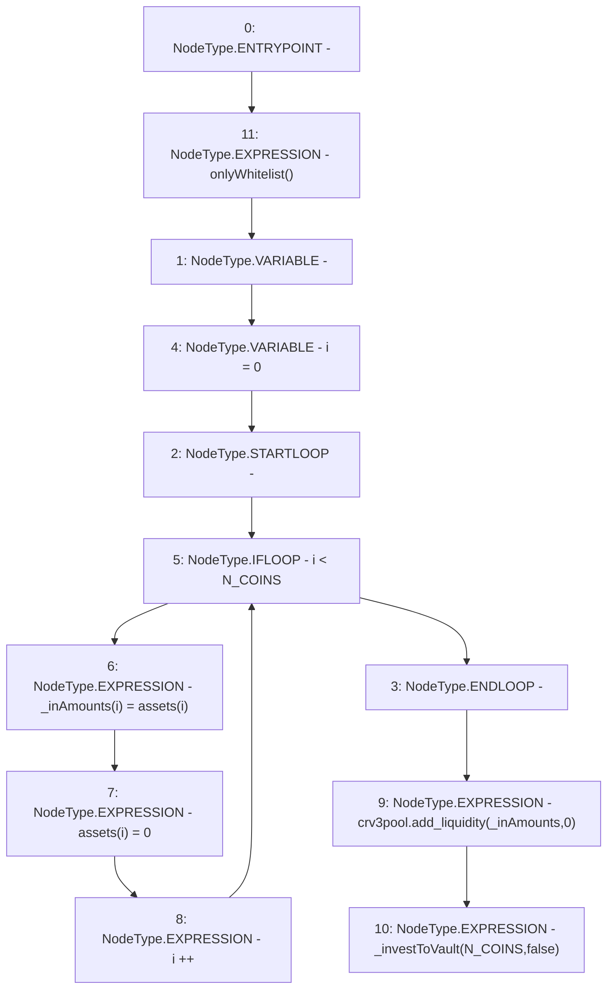

# Context: LifeGuard3Pool.investToCurveVault

**Contract:** `LifeGuard3Pool` (Inherits: FixedStablecoins, Constants, Whitelist, Controllable, Ownable, Context, ILifeGuard)
**Signature:** `investToCurveVault()`
**Method Selector ID:** `0xc34ec299`
**Visibility:** `external`
**Environment-Free:** `No (reads EVM state context)`
**Modifiers:**
- `onlyWhitelist`
  ```solidity
  modifier onlyWhitelist() {
          require(whitelist[msg.sender], "only whitelist");
          _;
      }
  ```

### State Variables Interaction
- **Reads:** N_COINS, assets, crv3pool
- **Writes:** assets

### Environment & Verification Flags
- **Uses Foundry Cheatcodes:** No
- **Has Echidna Properties:** No

### Internal Calls Tree
- None

### External Calls / Value Transfers
- `ICurve3Deposit.HIGH_LEVEL_CALL, dest:crv3pool(ICurve3Deposit), function:add_liquidity, arguments:['_inAmounts', '0']  `

### Control Flow Graph (CFG)


### Source Mapping
Declared in: `certora-ac-datasets/detasets/web3bugs/dataset/web3bugs/17/contracts/pools/LifeGuard3Pool.sol` on lines **123** to **131**

```solidity
    function investToCurveVault() external override onlyWhitelist {
        uint256[N_COINS] memory _inAmounts;
        for (uint256 i = 0; i < N_COINS; i++) {
            _inAmounts[i] = assets[i];
            assets[i] = 0;
        }
        crv3pool.add_liquidity(_inAmounts, 0);
        _investToVault(N_COINS, false);
    }

```
