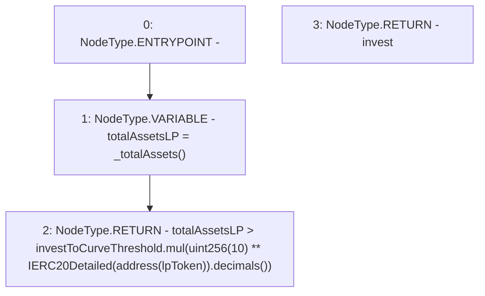

# Context: LifeGuard3Pool.investToCurveVaultTrigger

**Contract:** `LifeGuard3Pool` (Inherits: FixedStablecoins, Constants, Whitelist, Controllable, Ownable, Context, ILifeGuard)
**Signature:** `investToCurveVaultTrigger() returns (bool)`
**Method Selector ID:** `0x6f11fb79`
**Visibility:** `external`
**Environment-Free:** `Yes`
**Modifiers:** None

### State Variables Interaction
- **Reads:** investToCurveThreshold, lpToken
- **Writes:** None

### Environment & Verification Flags
- **Uses Foundry Cheatcodes:** No
- **Has Echidna Properties:** No

### Internal Calls Tree
- None

### External Calls / Value Transfers
- `SafeMath.TMP_204(uint256) = LIBRARY_CALL, dest:SafeMath, function:SafeMath.mul(uint256,uint256), arguments:['investToCurveThreshold', 'TMP_203'] `
- `IERC20Detailed.TMP_202(uint8) = HIGH_LEVEL_CALL, dest:TMP_201(IERC20Detailed), function:decimals, arguments:[]  `

### Control Flow Graph (CFG)


### Source Mapping
Declared in: `certora-ac-datasets/detasets/web3bugs/dataset/web3bugs/17/contracts/pools/LifeGuard3Pool.sol` on lines **134** to **137**

```solidity
    function investToCurveVaultTrigger() external view override returns (bool invest) {
        uint256 totalAssetsLP = _totalAssets();
        return totalAssetsLP > investToCurveThreshold.mul(uint256(10)**IERC20Detailed(address(lpToken)).decimals());
    }

```
