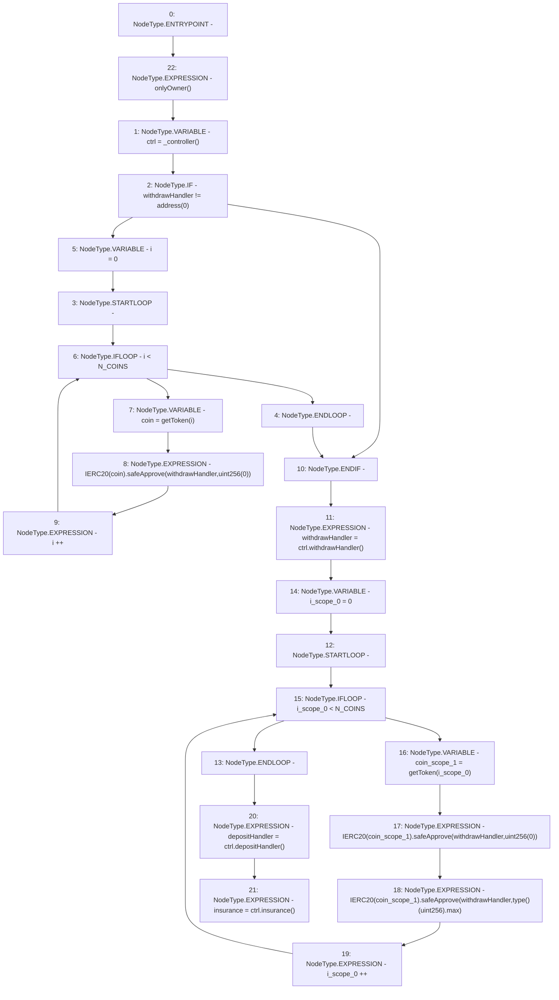

# Context: LifeGuard3Pool.setDependencies

**Contract:** `LifeGuard3Pool` (Inherits: FixedStablecoins, Constants, Whitelist, Controllable, Ownable, Context, ILifeGuard)
**Signature:** `setDependencies()`
**Method Selector ID:** `0x7f185162`
**Visibility:** `external`
**Environment-Free:** `No (reads EVM state context)`
**Modifiers:**
- `onlyOwner`
  ```solidity
  modifier onlyOwner() {
          require(owner() == _msgSender(), "Ownable: caller is not the owner");
          _;
      }
  ```

### State Variables Interaction
- **Reads:** N_COINS, withdrawHandler
- **Writes:** depositHandler, insurance, withdrawHandler

### Environment & Verification Flags
- **Uses Foundry Cheatcodes:** No
- **Has Echidna Properties:** No

### Internal Calls Tree
- None

### External Calls / Value Transfers
- `SafeERC20.LIBRARY_CALL, dest:SafeERC20, function:SafeERC20.safeApprove(IERC20,address,uint256), arguments:['TMP_160', 'withdrawHandler', 'TMP_161'] `
- `SafeERC20.LIBRARY_CALL, dest:SafeERC20, function:SafeERC20.safeApprove(IERC20,address,uint256), arguments:['TMP_153', 'withdrawHandler', 'TMP_154'] `
- `IController.TMP_168(address) = HIGH_LEVEL_CALL, dest:ctrl(IController), function:depositHandler, arguments:[]  `
- `IController.TMP_169(address) = HIGH_LEVEL_CALL, dest:ctrl(IController), function:insurance, arguments:[]  `
- `IController.TMP_157(address) = HIGH_LEVEL_CALL, dest:ctrl(IController), function:withdrawHandler, arguments:[]  `
- `SafeERC20.LIBRARY_CALL, dest:SafeERC20, function:SafeERC20.safeApprove(IERC20,address,uint256), arguments:['TMP_163', 'withdrawHandler', 'TMP_165'] `

### Control Flow Graph (CFG)


### Source Mapping
Declared in: `certora-ac-datasets/detasets/web3bugs/dataset/web3bugs/17/contracts/pools/LifeGuard3Pool.sol` on lines **76** to **92**

```solidity
    function setDependencies() external onlyOwner {
        IController ctrl = _controller();
        if (withdrawHandler != address(0)) {
            for (uint256 i = 0; i < N_COINS; i++) {
                address coin = getToken(i);
                IERC20(coin).safeApprove(withdrawHandler, uint256(0));
            }
        }
        withdrawHandler = ctrl.withdrawHandler();
        for (uint256 i = 0; i < N_COINS; i++) {
            address coin = getToken(i);
            IERC20(coin).safeApprove(withdrawHandler, uint256(0));
            IERC20(coin).safeApprove(withdrawHandler, type(uint256).max);
        }
        depositHandler = ctrl.depositHandler();
        insurance = ctrl.insurance();
    }

```
