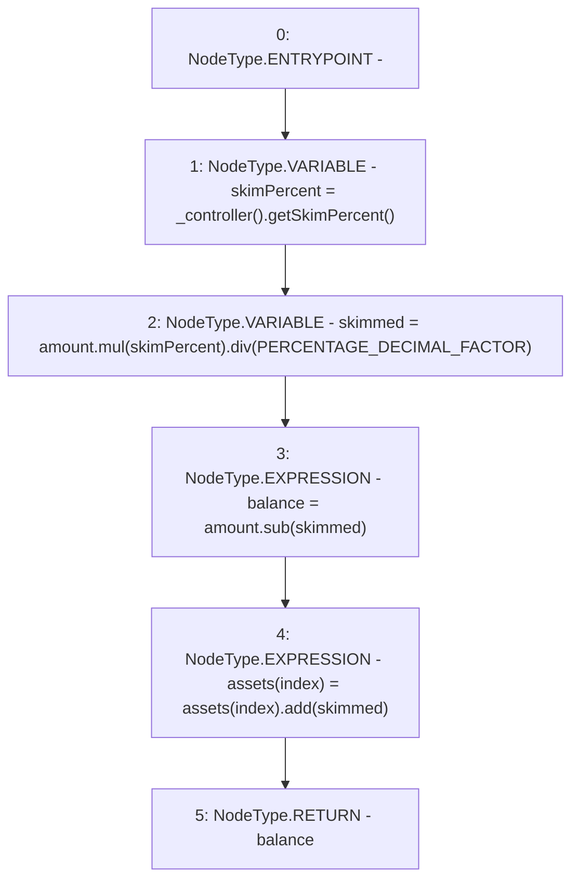

# Context: LifeGuard3Pool.skim

**Contract:** `LifeGuard3Pool` (Inherits: FixedStablecoins, Constants, Whitelist, Controllable, Ownable, Context, ILifeGuard)
**Signature:** `skim(uint256,uint256) returns (uint256)`
**Method Selector ID:** `Internal (No Method ID)`
**Visibility:** `internal`
**Environment-Free:** `Yes`
**Modifiers:** None

### State Variables Interaction
- **Reads:** PERCENTAGE_DECIMAL_FACTOR, assets
- **Writes:** assets

### Environment & Verification Flags
- **Uses Foundry Cheatcodes:** No
- **Has Echidna Properties:** No

### Internal Calls Tree
- None

### External Calls / Value Transfers
- `SafeMath.TMP_238(uint256) = LIBRARY_CALL, dest:SafeMath, function:SafeMath.div(uint256,uint256), arguments:['TMP_237', 'PERCENTAGE_DECIMAL_FACTOR'] `
- `SafeMath.TMP_237(uint256) = LIBRARY_CALL, dest:SafeMath, function:SafeMath.mul(uint256,uint256), arguments:['amount', 'skimPercent'] `
- `SafeMath.TMP_239(uint256) = LIBRARY_CALL, dest:SafeMath, function:SafeMath.sub(uint256,uint256), arguments:['amount', 'skimmed'] `
- `IController.TMP_236(uint256) = HIGH_LEVEL_CALL, dest:TMP_235(IController), function:getSkimPercent, arguments:[]  `
- `SafeMath.TMP_240(uint256) = LIBRARY_CALL, dest:SafeMath, function:SafeMath.add(uint256,uint256), arguments:['REF_75', 'skimmed'] `

### Control Flow Graph (CFG)


### Source Mapping
Declared in: `certora-ac-datasets/detasets/web3bugs/dataset/web3bugs/17/contracts/pools/LifeGuard3Pool.sol` on lines **189** to **194**

```solidity
    function skim(uint256 amount, uint256 index) internal returns (uint256 balance) {
        uint256 skimPercent = _controller().getSkimPercent();
        uint256 skimmed = amount.mul(skimPercent).div(PERCENTAGE_DECIMAL_FACTOR);
        balance = amount.sub(skimmed);
        assets[index] = assets[index].add(skimmed);
    }

```
