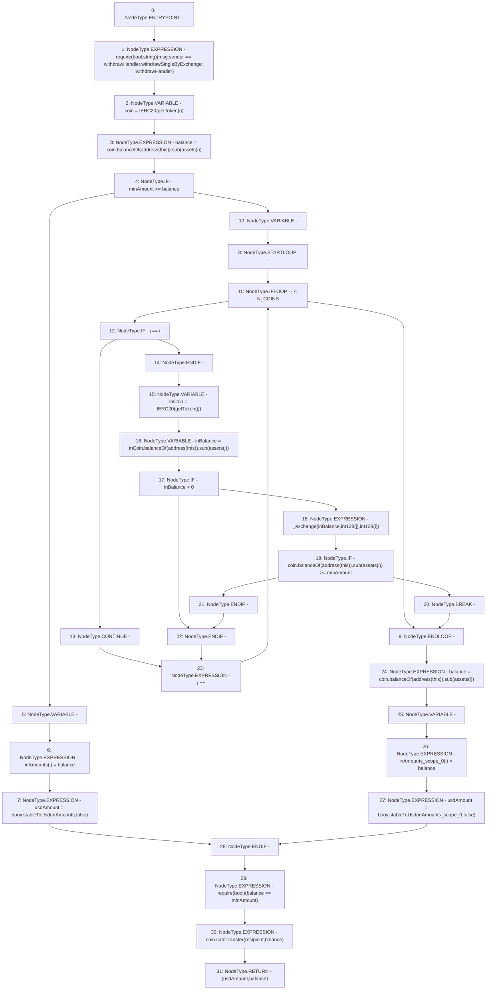

# Context: LifeGuard3Pool.withdrawSingleByExchange

**Contract:** `LifeGuard3Pool` (Inherits: FixedStablecoins, Constants, Whitelist, Controllable, Ownable, Context, ILifeGuard)
**Signature:** `withdrawSingleByExchange(uint256,uint256,address) returns (uint256, uint256)`
**Method Selector ID:** `0xd8c3e814`
**Visibility:** `external`
**Environment-Free:** `No (reads EVM state context)`
**Modifiers:** None

### State Variables Interaction
- **Reads:** N_COINS, assets, buoy, withdrawHandler
- **Writes:** None

### Assertion Checks & Business Requirements
- require/assert: `require(bool,string)(msg.sender == withdrawHandler,withdrawSingleByExchange: !withdrawHandler)`
- require/assert: `require(bool)(balance >= minAmount)`

### Environment & Verification Flags
- **Uses Foundry Cheatcodes:** No
- **Has Echidna Properties:** No

### Internal Calls Tree
- None

### External Calls / Value Transfers
- `SafeMath.TMP_293(uint256) = LIBRARY_CALL, dest:SafeMath, function:SafeMath.sub(uint256,uint256), arguments:['TMP_292', 'REF_102'] `
- `SafeMath.TMP_286(uint256) = LIBRARY_CALL, dest:SafeMath, function:SafeMath.sub(uint256,uint256), arguments:['TMP_285', 'REF_99'] `
- `IERC20.TMP_285(uint256) = HIGH_LEVEL_CALL, dest:inCoin(IERC20), function:balanceOf, arguments:['TMP_284']  `
- `IERC20.TMP_297(uint256) = HIGH_LEVEL_CALL, dest:coin(IERC20), function:balanceOf, arguments:['TMP_296']  `
- `IERC20.TMP_276(uint256) = HIGH_LEVEL_CALL, dest:coin(IERC20), function:balanceOf, arguments:['TMP_275']  `
- `SafeERC20.LIBRARY_CALL, dest:SafeERC20, function:SafeERC20.safeTransfer(IERC20,address,uint256), arguments:['coin', 'recipient', 'balance'] `
- `SafeMath.TMP_298(uint256) = LIBRARY_CALL, dest:SafeMath, function:SafeMath.sub(uint256,uint256), arguments:['TMP_297', 'REF_105'] `
- `SafeMath.TMP_277(uint256) = LIBRARY_CALL, dest:SafeMath, function:SafeMath.sub(uint256,uint256), arguments:['TMP_276', 'REF_94'] `
- `IBuoy.TMP_299(uint256) = HIGH_LEVEL_CALL, dest:buoy(IBuoy), function:stableToUsd, arguments:['inAmounts_scope_0', 'False']  `
- `IBuoy.TMP_279(uint256) = HIGH_LEVEL_CALL, dest:buoy(IBuoy), function:stableToUsd, arguments:['inAmounts', 'False']  `
- `IERC20.TMP_292(uint256) = HIGH_LEVEL_CALL, dest:coin(IERC20), function:balanceOf, arguments:['TMP_291']  `

### Control Flow Graph (CFG)


### Source Mapping
Declared in: `certora-ac-datasets/detasets/web3bugs/dataset/web3bugs/17/contracts/pools/LifeGuard3Pool.sol` on lines **235** to **270**

```solidity
    function withdrawSingleByExchange(
        uint256 i,
        uint256 minAmount,
        address recipient
    ) external override returns (uint256 usdAmount, uint256 balance) {
        require(msg.sender == withdrawHandler, "withdrawSingleByExchange: !withdrawHandler");
        IERC20 coin = IERC20(getToken(i));
        balance = coin.balanceOf(address(this)).sub(assets[i]);
        // Are available assets - locked assets for LP vault more than required
        // minAmount. Then estimate USD value and transfer...
        if (minAmount <= balance) {
            uint256[N_COINS] memory inAmounts;
            inAmounts[i] = balance;
            usdAmount = buoy.stableToUsd(inAmounts, false);
            // ...if not, swap other loose assets into target assets before
            // estimating USD value and transfering.
        } else {
            for (uint256 j; j < N_COINS; j++) {
                if (j == i) continue;
                IERC20 inCoin = IERC20(getToken(j));
                uint256 inBalance = inCoin.balanceOf(address(this)).sub(assets[j]);
                if (inBalance > 0) {
                    _exchange(inBalance, int128(j), int128(i));
                    if (coin.balanceOf(address(this)).sub(assets[i]) >= minAmount) {
                        break;
                    }
                }
            }
            balance = coin.balanceOf(address(this)).sub(assets[i]);
            uint256[N_COINS] memory inAmounts;
            inAmounts[i] = balance;
            usdAmount = buoy.stableToUsd(inAmounts, false);
        }
        require(balance >= minAmount);
        coin.safeTransfer(recipient, balance);
    }

```
