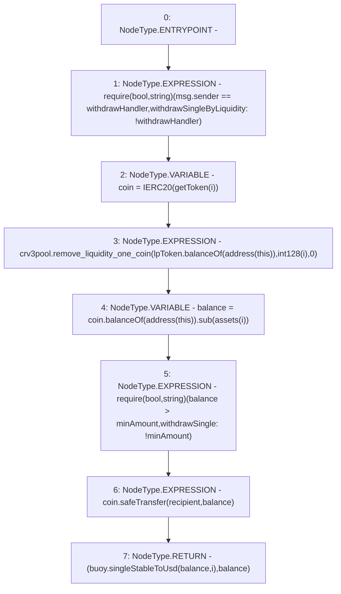

# Context: LifeGuard3Pool.withdrawSingleByLiquidity

**Contract:** `LifeGuard3Pool` (Inherits: FixedStablecoins, Constants, Whitelist, Controllable, Ownable, Context, ILifeGuard)
**Signature:** `withdrawSingleByLiquidity(uint256,uint256,address) returns (uint256, uint256)`
**Method Selector ID:** `0xe7708b30`
**Visibility:** `external`
**Environment-Free:** `No (reads EVM state context)`
**Modifiers:** None

### State Variables Interaction
- **Reads:** assets, buoy, crv3pool, lpToken, withdrawHandler
- **Writes:** None

### Assertion Checks & Business Requirements
- require/assert: `require(bool,string)(msg.sender == withdrawHandler,withdrawSingleByLiquidity: !withdrawHandler)`
- require/assert: `require(bool,string)(balance > minAmount,withdrawSingle: !minAmount)`

### Environment & Verification Flags
- **Uses Foundry Cheatcodes:** No
- **Has Echidna Properties:** No

### Internal Calls Tree
- None

### External Calls / Value Transfers
- `IERC20.TMP_261(uint256) = HIGH_LEVEL_CALL, dest:lpToken(IERC20), function:balanceOf, arguments:['TMP_260']  `
- `IBuoy.TMP_270(uint256) = HIGH_LEVEL_CALL, dest:buoy(IBuoy), function:singleStableToUsd, arguments:['balance', 'i']  `
- `SafeERC20.LIBRARY_CALL, dest:SafeERC20, function:SafeERC20.safeTransfer(IERC20,address,uint256), arguments:['coin', 'recipient', 'balance'] `
- `ICurve3Deposit.HIGH_LEVEL_CALL, dest:crv3pool(ICurve3Deposit), function:remove_liquidity_one_coin, arguments:['TMP_261', 'TMP_262', '0']  `
- `IERC20.TMP_265(uint256) = HIGH_LEVEL_CALL, dest:coin(IERC20), function:balanceOf, arguments:['TMP_264']  `
- `SafeMath.TMP_266(uint256) = LIBRARY_CALL, dest:SafeMath, function:SafeMath.sub(uint256,uint256), arguments:['TMP_265', 'REF_89'] `

### Control Flow Graph (CFG)


### Source Mapping
Declared in: `certora-ac-datasets/detasets/web3bugs/dataset/web3bugs/17/contracts/pools/LifeGuard3Pool.sol` on lines **215** to **227**

```solidity
    function withdrawSingleByLiquidity(
        uint256 i,
        uint256 minAmount,
        address recipient
    ) external override returns (uint256, uint256) {
        require(msg.sender == withdrawHandler, "withdrawSingleByLiquidity: !withdrawHandler");
        IERC20 coin = IERC20(getToken(i));
        crv3pool.remove_liquidity_one_coin(lpToken.balanceOf(address(this)), int128(i), 0);
        uint256 balance = coin.balanceOf(address(this)).sub(assets[i]);
        require(balance > minAmount, "withdrawSingle: !minAmount");
        coin.safeTransfer(recipient, balance);
        return (buoy.singleStableToUsd(balance, i), balance);
    }

```
