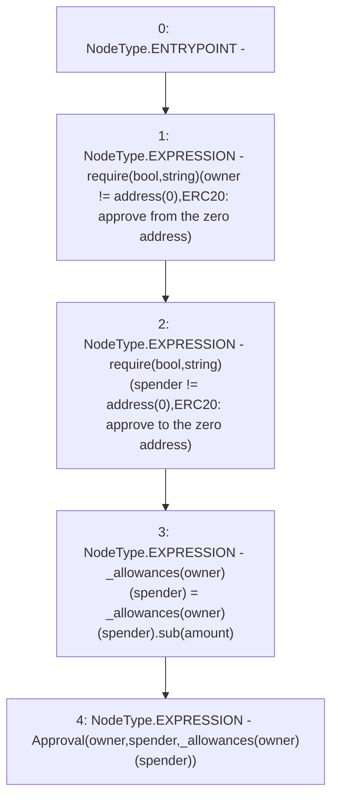

# Context: NonRebasingGToken._decreaseApproved

**Contract:** `NonRebasingGToken` (Inherits: GToken, IToken, Whitelist, Ownable, Constants, GERC20, IERC20, Context)
**Signature:** `_decreaseApproved(address,address,uint256)`
**Method Selector ID:** `Internal (No Method ID)`
**Visibility:** `internal`
**Environment-Free:** `Yes`
**Modifiers:** None

### State Variables Interaction
- **Reads:** _allowances
- **Writes:** _allowances

### Assertion Checks & Business Requirements
- require/assert: `require(bool,string)(owner != address(0),ERC20: approve from the zero address)`
- require/assert: `require(bool,string)(spender != address(0),ERC20: approve to the zero address)`

### Environment & Verification Flags
- **Uses Foundry Cheatcodes:** No
- **Has Echidna Properties:** No

### Internal Calls Tree
- None

### External Calls / Value Transfers
- `SafeMath.TMP_316(uint256) = LIBRARY_CALL, dest:SafeMath, function:SafeMath.sub(uint256,uint256), arguments:['REF_129', 'amount'] `

### Control Flow Graph (CFG)


### Source Mapping
Declared in: `certora-ac-datasets/detasets/web3bugs/dataset/web3bugs/17/contracts/tokens/GERC20.sol` on lines **316** to **326**

```solidity
    function _decreaseApproved(
        address owner,
        address spender,
        uint256 amount
    ) internal virtual {
        require(owner != address(0), "ERC20: approve from the zero address");
        require(spender != address(0), "ERC20: approve to the zero address");

        _allowances[owner][spender] = _allowances[owner][spender].sub(amount);
        emit Approval(owner, spender, _allowances[owner][spender]);
    }

```
