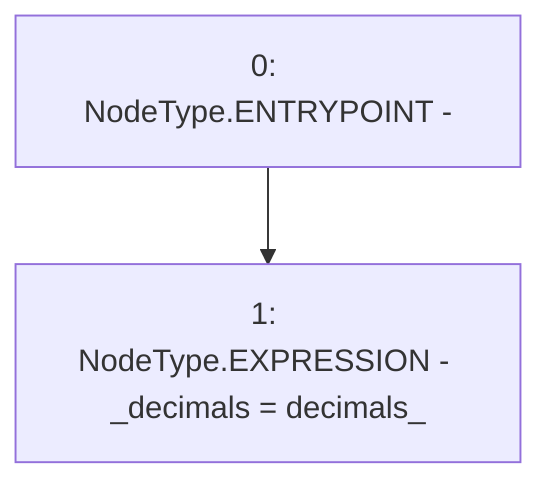

# Context: NonRebasingGToken._setupDecimals

**Contract:** `NonRebasingGToken` (Inherits: GToken, IToken, Whitelist, Ownable, Constants, GERC20, IERC20, Context)
**Signature:** `_setupDecimals(uint8)`
**Method Selector ID:** `Internal (No Method ID)`
**Visibility:** `internal`
**Environment-Free:** `Yes`
**Modifiers:** None

### State Variables Interaction
- **Reads:** None
- **Writes:** _decimals

### Environment & Verification Flags
- **Uses Foundry Cheatcodes:** No
- **Has Echidna Properties:** No

### Internal Calls Tree
- None

### External Calls / Value Transfers
- None

### Control Flow Graph (CFG)


### Source Mapping
Declared in: `certora-ac-datasets/detasets/web3bugs/dataset/web3bugs/17/contracts/tokens/GERC20.sol` on lines **335** to **337**

```solidity
    function _setupDecimals(uint8 decimals_) internal {
        _decimals = decimals_;
    }

```
