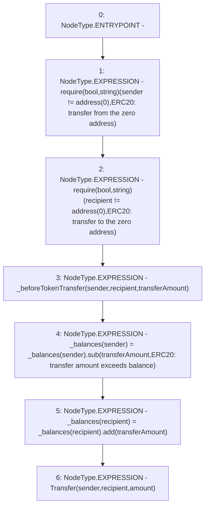

# Context: NonRebasingGToken._transfer

**Contract:** `NonRebasingGToken` (Inherits: GToken, IToken, Whitelist, Ownable, Constants, GERC20, IERC20, Context)
**Signature:** `_transfer(address,address,uint256,uint256)`
**Method Selector ID:** `Internal (No Method ID)`
**Visibility:** `internal`
**Environment-Free:** `Yes`
**Modifiers:** None

### State Variables Interaction
- **Reads:** _balances
- **Writes:** _balances

### Assertion Checks & Business Requirements
- require/assert: `require(bool,string)(sender != address(0),ERC20: transfer from the zero address)`
- require/assert: `require(bool,string)(recipient != address(0),ERC20: transfer to the zero address)`

### Environment & Verification Flags
- **Uses Foundry Cheatcodes:** No
- **Has Echidna Properties:** No

### Internal Calls Tree
- None

### External Calls / Value Transfers
- `SafeMath.TMP_283(uint256) = LIBRARY_CALL, dest:SafeMath, function:SafeMath.add(uint256,uint256), arguments:['REF_114', 'transferAmount'] `
- `SafeMath.TMP_282(uint256) = LIBRARY_CALL, dest:SafeMath, function:SafeMath.sub(uint256,uint256,string), arguments:['REF_111', 'transferAmount', 'ERC20: transfer amount exceeds balance'] `
- `TMP_277(None) = SOLIDITY_CALL require(bool,string)(TMP_276,ERC20: transfer from the zero address)`
- `TMP_280(None) = SOLIDITY_CALL require(bool,string)(TMP_279,ERC20: transfer to the zero address)`

### Control Flow Graph (CFG)


### Source Mapping
Declared in: `certora-ac-datasets/detasets/web3bugs/dataset/web3bugs/17/contracts/tokens/GERC20.sol` on lines **225** to **239**

```solidity
    function _transfer(
        address sender,
        address recipient,
        uint256 transferAmount,
        uint256 amount
    ) internal virtual {
        require(sender != address(0), "ERC20: transfer from the zero address");
        require(recipient != address(0), "ERC20: transfer to the zero address");

        _beforeTokenTransfer(sender, recipient, transferAmount);

        _balances[sender] = _balances[sender].sub(transferAmount, "ERC20: transfer amount exceeds balance");
        _balances[recipient] = _balances[recipient].add(transferAmount);
        emit Transfer(sender, recipient, amount);
    }

```
