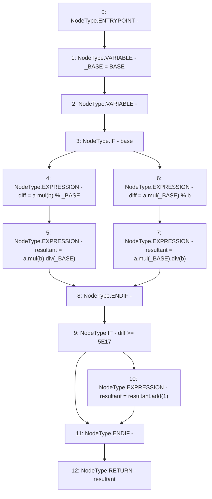

# Context: NonRebasingGToken.applyFactor

**Contract:** `NonRebasingGToken` (Inherits: GToken, IToken, Whitelist, Ownable, Constants, GERC20, IERC20, Context)
**Signature:** `applyFactor(uint256,uint256,bool) returns (uint256)`
**Method Selector ID:** `Internal (No Method ID)`
**Visibility:** `internal`
**Environment-Free:** `Yes`
**Modifiers:** None

### State Variables Interaction
- **Reads:** BASE
- **Writes:** None

### Environment & Verification Flags
- **Uses Foundry Cheatcodes:** No
- **Has Echidna Properties:** No

### Internal Calls Tree
- None

### External Calls / Value Transfers
- `SafeMath.TMP_218(uint256) = LIBRARY_CALL, dest:SafeMath, function:SafeMath.mul(uint256,uint256), arguments:['a', 'b'] `
- `SafeMath.TMP_221(uint256) = LIBRARY_CALL, dest:SafeMath, function:SafeMath.div(uint256,uint256), arguments:['TMP_220', '_BASE'] `
- `SafeMath.TMP_222(uint256) = LIBRARY_CALL, dest:SafeMath, function:SafeMath.mul(uint256,uint256), arguments:['a', '_BASE'] `
- `SafeMath.TMP_227(uint256) = LIBRARY_CALL, dest:SafeMath, function:SafeMath.add(uint256,uint256), arguments:['resultant', '1'] `
- `SafeMath.TMP_224(uint256) = LIBRARY_CALL, dest:SafeMath, function:SafeMath.mul(uint256,uint256), arguments:['a', '_BASE'] `
- `SafeMath.TMP_225(uint256) = LIBRARY_CALL, dest:SafeMath, function:SafeMath.div(uint256,uint256), arguments:['TMP_224', 'b'] `
- `SafeMath.TMP_220(uint256) = LIBRARY_CALL, dest:SafeMath, function:SafeMath.mul(uint256,uint256), arguments:['a', 'b'] `

### Control Flow Graph (CFG)


### Source Mapping
Declared in: `certora-ac-datasets/detasets/web3bugs/dataset/web3bugs/17/contracts/tokens/GToken.sol` on lines **42** to **59**

```solidity
    function applyFactor(
        uint256 a,
        uint256 b,
        bool base
    ) internal pure returns (uint256 resultant) {
        uint256 _BASE = BASE;
        uint256 diff;
        if (base) {
            diff = a.mul(b) % _BASE;
            resultant = a.mul(b).div(_BASE);
        } else {
            diff = a.mul(_BASE) % b;
            resultant = a.mul(_BASE).div(b);
        }
        if (diff >= 5E17) {
            resultant = resultant.add(1);
        }
    }

```
