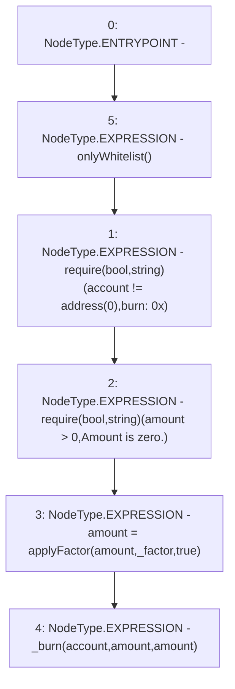

# Context: NonRebasingGToken.burn

**Contract:** `NonRebasingGToken` (Inherits: GToken, IToken, Whitelist, Ownable, Constants, GERC20, IERC20, Context)
**Signature:** `burn(address,uint256,uint256)`
**Method Selector ID:** `0xf5298aca`
**Visibility:** `external`
**Environment-Free:** `No (reads EVM state context)`
**Modifiers:**
- `onlyWhitelist`
  ```solidity
  modifier onlyWhitelist() {
          require(whitelist[msg.sender], "only whitelist");
          _;
      }
  ```

### State Variables Interaction
- **Reads:** None
- **Writes:** None

### Assertion Checks & Business Requirements
- require/assert: `require(bool,string)(account != address(0),burn: 0x)`
- require/assert: `require(bool,string)(amount > 0,Amount is zero.)`

### Environment & Verification Flags
- **Uses Foundry Cheatcodes:** No
- **Has Echidna Properties:** No

### Internal Calls Tree
- None

### External Calls / Value Transfers
- None

### Control Flow Graph (CFG)


### Source Mapping
Declared in: `certora-ac-datasets/detasets/web3bugs/dataset/web3bugs/17/contracts/tokens/NonRebasingGToken.sol` on lines **87** to **97**

```solidity
    function burn(
        address account,
        uint256 _factor,
        uint256 amount
    ) external override onlyWhitelist {
        require(account != address(0), "burn: 0x");
        require(amount > 0, "Amount is zero.");
        // Divide USD amount by factor to get number of tokens to burn
        amount = applyFactor(amount, _factor, true);
        _burn(account, amount, amount);
    }

```
