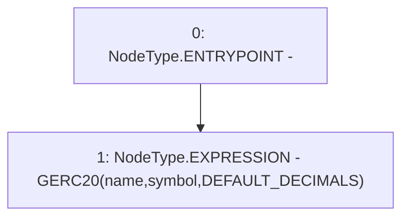

# Context: NonRebasingGToken.constructor

**Contract:** `NonRebasingGToken` (Inherits: GToken, IToken, Whitelist, Ownable, Constants, GERC20, IERC20, Context)
**Signature:** `constructor(string,string)`
**Method Selector ID:** `0xd4d8c5c3`
**Visibility:** `public`
**Environment-Free:** `Yes`
**Modifiers:** None

### State Variables Interaction
- **Reads:** DEFAULT_DECIMALS
- **Writes:** None

### Environment & Verification Flags
- **Uses Foundry Cheatcodes:** No
- **Has Echidna Properties:** No

### Internal Calls Tree
- None

### External Calls / Value Transfers
- None

### Control Flow Graph (CFG)


### Source Mapping
Declared in: `certora-ac-datasets/detasets/web3bugs/dataset/web3bugs/17/contracts/tokens/GToken.sol` on lines **32** to **32**

```solidity
    constructor(string memory name, string memory symbol) public GERC20(name, symbol, DEFAULT_DECIMALS) {}

```
