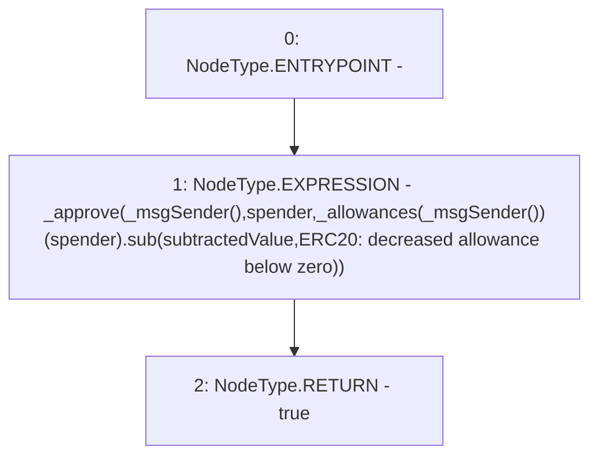

# Context: NonRebasingGToken.decreaseAllowance

**Contract:** `NonRebasingGToken` (Inherits: GToken, IToken, Whitelist, Ownable, Constants, GERC20, IERC20, Context)
**Signature:** `decreaseAllowance(address,uint256) returns (bool)`
**Method Selector ID:** `0xa457c2d7`
**Visibility:** `public`
**Environment-Free:** `No (reads EVM state context)`
**Modifiers:** None

### State Variables Interaction
- **Reads:** _allowances
- **Writes:** None

### Environment & Verification Flags
- **Uses Foundry Cheatcodes:** No
- **Has Echidna Properties:** No

### Internal Calls Tree
- None

### External Calls / Value Transfers
- `SafeMath.TMP_273(uint256) = LIBRARY_CALL, dest:SafeMath, function:SafeMath.sub(uint256,uint256,string), arguments:['REF_108', 'subtractedValue', 'ERC20: decreased allowance below zero'] `

### Control Flow Graph (CFG)


### Source Mapping
Declared in: `certora-ac-datasets/detasets/web3bugs/dataset/web3bugs/17/contracts/tokens/GERC20.sol` on lines **202** to **209**

```solidity
    function decreaseAllowance(address spender, uint256 subtractedValue) public virtual returns (bool) {
        _approve(
            _msgSender(),
            spender,
            _allowances[_msgSender()][spender].sub(subtractedValue, "ERC20: decreased allowance below zero")
        );
        return true;
    }

```
