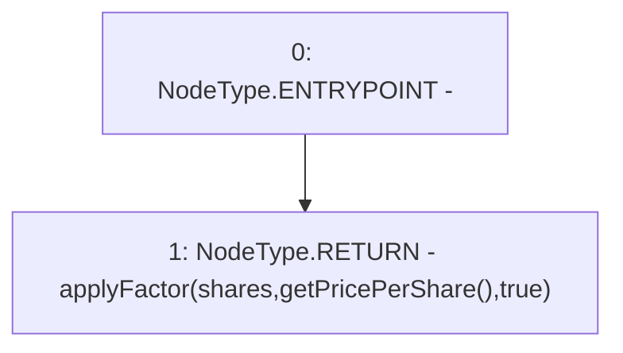

# Context: NonRebasingGToken.getShareAssets

**Contract:** `NonRebasingGToken` (Inherits: GToken, IToken, Whitelist, Ownable, Constants, GERC20, IERC20, Context)
**Signature:** `getShareAssets(uint256) returns (uint256)`
**Method Selector ID:** `0x11d1dcd2`
**Visibility:** `public`
**Environment-Free:** `Yes`
**Modifiers:** None

### State Variables Interaction
- **Reads:** None
- **Writes:** None

### Environment & Verification Flags
- **Uses Foundry Cheatcodes:** No
- **Has Echidna Properties:** No

### Internal Calls Tree
- None

### External Calls / Value Transfers
- None

### Control Flow Graph (CFG)


### Source Mapping
Declared in: `certora-ac-datasets/detasets/web3bugs/dataset/web3bugs/17/contracts/tokens/NonRebasingGToken.sol` on lines **53** to **55**

```solidity
    function getShareAssets(uint256 shares) public view override returns (uint256) {
        return applyFactor(shares, getPricePerShare(), true);
    }

```
