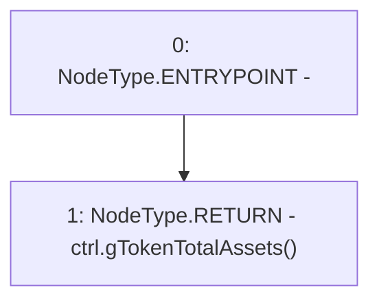

# Context: NonRebasingGToken.totalAssets

**Contract:** `NonRebasingGToken` (Inherits: GToken, IToken, Whitelist, Ownable, Constants, GERC20, IERC20, Context)
**Signature:** `totalAssets() returns (uint256)`
**Method Selector ID:** `0x01e1d114`
**Visibility:** `public`
**Environment-Free:** `Yes`
**Modifiers:** None

### State Variables Interaction
- **Reads:** ctrl
- **Writes:** None

### Environment & Verification Flags
- **Uses Foundry Cheatcodes:** No
- **Has Echidna Properties:** No

### Internal Calls Tree
- None

### External Calls / Value Transfers
- `IController.TMP_235(uint256) = HIGH_LEVEL_CALL, dest:ctrl(IController), function:gTokenTotalAssets, arguments:[]  `

### Control Flow Graph (CFG)


### Source Mapping
Declared in: `certora-ac-datasets/detasets/web3bugs/dataset/web3bugs/17/contracts/tokens/GToken.sol` on lines **74** to **76**

```solidity
    function totalAssets() public view override returns (uint256) {
        return ctrl.gTokenTotalAssets();
    }

```
