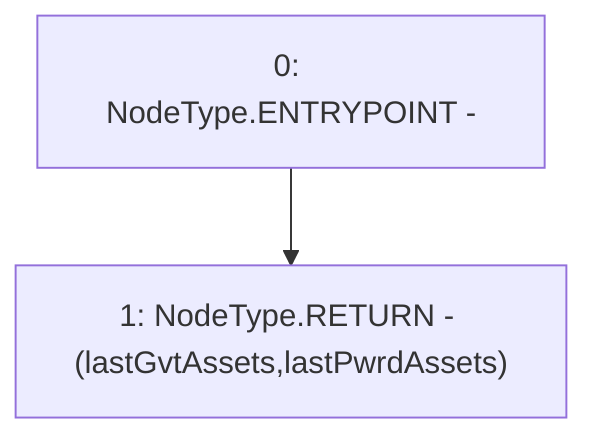

# Context: PnL.calcPnL

**Contract:** `PnL` (Inherits: IPnL, FixedGTokens, Constants, Controllable, Ownable, Context)
**Signature:** `calcPnL() returns (uint256, uint256)`
**Method Selector ID:** `0x20458c55`
**Visibility:** `external`
**Environment-Free:** `Yes`
**Modifiers:** None

### State Variables Interaction
- **Reads:** lastGvtAssets, lastPwrdAssets
- **Writes:** None

### Environment & Verification Flags
- **Uses Foundry Cheatcodes:** No
- **Has Echidna Properties:** No

### Internal Calls Tree
- None

### External Calls / Value Transfers
- None

### Control Flow Graph (CFG)


### Source Mapping
Declared in: `certora-ac-datasets/detasets/web3bugs/dataset/web3bugs/17/contracts/pnl/PnL.sol` on lines **144** to **146**

```solidity
    function calcPnL() external view override returns (uint256, uint256) {
        return (lastGvtAssets, lastPwrdAssets);
    }

```
