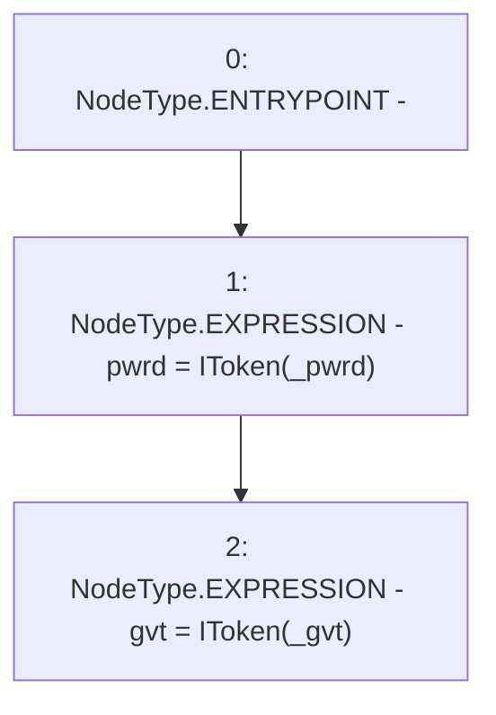

# Context: PnL.constructor

**Contract:** `PnL` (Inherits: IPnL, FixedGTokens, Constants, Controllable, Ownable, Context)
**Signature:** `constructor(address,address)`
**Method Selector ID:** `0x4525f804`
**Visibility:** `public`
**Environment-Free:** `Yes`
**Modifiers:** None

### State Variables Interaction
- **Reads:** None
- **Writes:** gvt, pwrd

### Environment & Verification Flags
- **Uses Foundry Cheatcodes:** No
- **Has Echidna Properties:** No

### Internal Calls Tree
- None

### External Calls / Value Transfers
- None

### Control Flow Graph (CFG)


### Source Mapping
Declared in: `certora-ac-datasets/detasets/web3bugs/dataset/web3bugs/17/contracts/common/FixedContracts.sol` on lines **63** to **66**

```solidity
    constructor(address _pwrd, address _gvt) public {
        pwrd = IToken(_pwrd);
        gvt = IToken(_gvt);
    }

```
