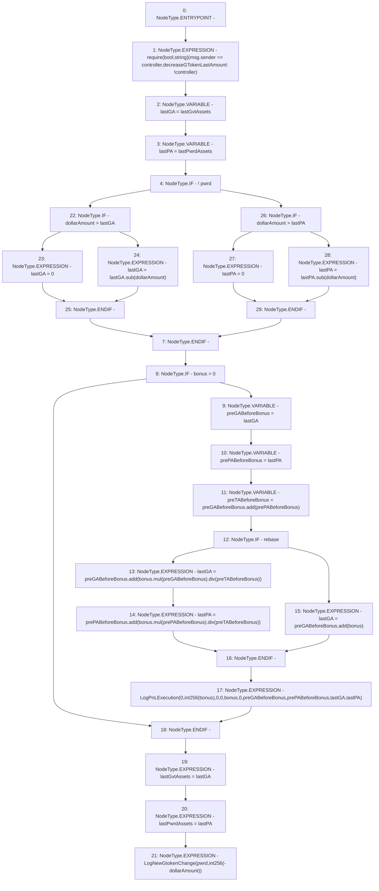

# Context: PnL.decreaseGTokenLastAmount

**Contract:** `PnL` (Inherits: IPnL, FixedGTokens, Constants, Controllable, Ownable, Context)
**Signature:** `decreaseGTokenLastAmount(bool,uint256,uint256)`
**Method Selector ID:** `0x4175e521`
**Visibility:** `external`
**Environment-Free:** `No (reads EVM state context)`
**Modifiers:** None

### State Variables Interaction
- **Reads:** controller, lastGvtAssets, lastPwrdAssets, rebase
- **Writes:** lastGvtAssets, lastPwrdAssets

### Assertion Checks & Business Requirements
- require/assert: `require(bool,string)(msg.sender == controller,decreaseGTokenLastAmount: !controller)`

### Environment & Verification Flags
- **Uses Foundry Cheatcodes:** No
- **Has Echidna Properties:** No

### Internal Calls Tree
- None

### External Calls / Value Transfers
- `SafeMath.TMP_120(uint256) = LIBRARY_CALL, dest:SafeMath, function:SafeMath.div(uint256,uint256), arguments:['TMP_119', 'preTABeforeBonus'] `
- `SafeMath.TMP_121(uint256) = LIBRARY_CALL, dest:SafeMath, function:SafeMath.add(uint256,uint256), arguments:['prePABeforeBonus', 'TMP_120'] `
- `SafeMath.TMP_122(uint256) = LIBRARY_CALL, dest:SafeMath, function:SafeMath.add(uint256,uint256), arguments:['preGABeforeBonus', 'bonus'] `
- `SafeMath.TMP_129(uint256) = LIBRARY_CALL, dest:SafeMath, function:SafeMath.sub(uint256,uint256), arguments:['lastGA', 'dollarAmount'] `
- `SafeMath.TMP_116(uint256) = LIBRARY_CALL, dest:SafeMath, function:SafeMath.mul(uint256,uint256), arguments:['bonus', 'preGABeforeBonus'] `
- `SafeMath.TMP_115(uint256) = LIBRARY_CALL, dest:SafeMath, function:SafeMath.add(uint256,uint256), arguments:['preGABeforeBonus', 'prePABeforeBonus'] `
- `SafeMath.TMP_119(uint256) = LIBRARY_CALL, dest:SafeMath, function:SafeMath.mul(uint256,uint256), arguments:['bonus', 'prePABeforeBonus'] `
- `SafeMath.TMP_117(uint256) = LIBRARY_CALL, dest:SafeMath, function:SafeMath.div(uint256,uint256), arguments:['TMP_116', 'preTABeforeBonus'] `
- `SafeMath.TMP_131(uint256) = LIBRARY_CALL, dest:SafeMath, function:SafeMath.sub(uint256,uint256), arguments:['lastPA', 'dollarAmount'] `
- `SafeMath.TMP_118(uint256) = LIBRARY_CALL, dest:SafeMath, function:SafeMath.add(uint256,uint256), arguments:['preGABeforeBonus', 'TMP_117'] `

### Control Flow Graph (CFG)


### Source Mapping
Declared in: `certora-ac-datasets/detasets/web3bugs/dataset/web3bugs/17/contracts/pnl/PnL.sol` on lines **112** to **141**

```solidity
    function decreaseGTokenLastAmount(
        bool pwrd,
        uint256 dollarAmount,
        uint256 bonus
    ) external override {
        require(msg.sender == controller, "decreaseGTokenLastAmount: !controller");
        uint256 lastGA = lastGvtAssets;
        uint256 lastPA = lastPwrdAssets;
        if (!pwrd) {
            lastGA = dollarAmount > lastGA ? 0 : lastGA.sub(dollarAmount);
        } else {
            lastPA = dollarAmount > lastPA ? 0 : lastPA.sub(dollarAmount);
        }
        if (bonus > 0) {
            uint256 preGABeforeBonus = lastGA;
            uint256 prePABeforeBonus = lastPA;
            uint256 preTABeforeBonus = preGABeforeBonus.add(prePABeforeBonus);
            if (rebase) {
                lastGA = preGABeforeBonus.add(bonus.mul(preGABeforeBonus).div(preTABeforeBonus));
                lastPA = prePABeforeBonus.add(bonus.mul(prePABeforeBonus).div(preTABeforeBonus));
            } else {
                lastGA = preGABeforeBonus.add(bonus);
            }
            emit LogPnLExecution(0, int256(bonus), 0, 0, bonus, 0, preGABeforeBonus, prePABeforeBonus, lastGA, lastPA);
        }

        lastGvtAssets = lastGA;
        lastPwrdAssets = lastPA;
        emit LogNewGtokenChange(pwrd, int256(-dollarAmount));
    }

```
