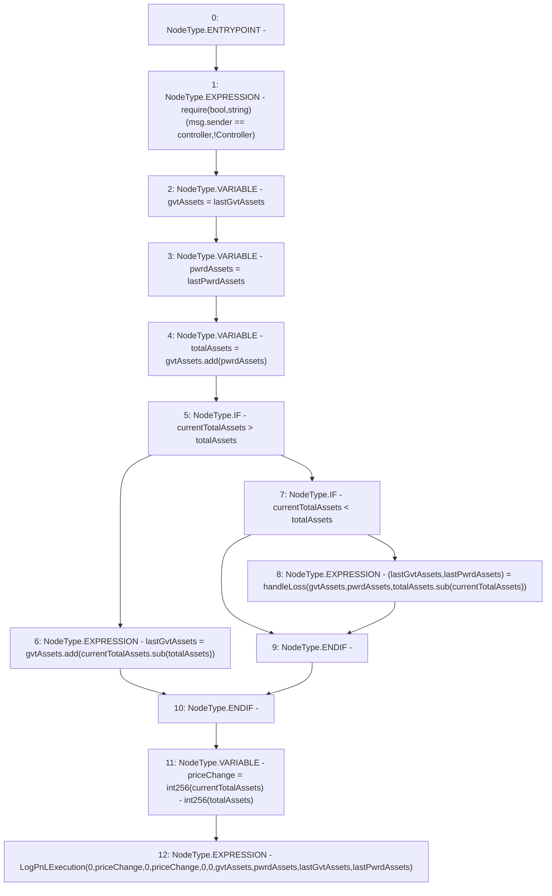

# Context: PnL.distributePriceChange

**Contract:** `PnL` (Inherits: IPnL, FixedGTokens, Constants, Controllable, Ownable, Context)
**Signature:** `distributePriceChange(uint256)`
**Method Selector ID:** `0xe3d94944`
**Visibility:** `external`
**Environment-Free:** `No (reads EVM state context)`
**Modifiers:** None

### State Variables Interaction
- **Reads:** controller, lastGvtAssets, lastPwrdAssets
- **Writes:** lastGvtAssets, lastPwrdAssets

### Assertion Checks & Business Requirements
- require/assert: `require(bool,string)(msg.sender == controller,!Controller)`

### Environment & Verification Flags
- **Uses Foundry Cheatcodes:** No
- **Has Echidna Properties:** No

### Internal Calls Tree
- None

### External Calls / Value Transfers
- `SafeMath.TMP_197(uint256) = LIBRARY_CALL, dest:SafeMath, function:SafeMath.sub(uint256,uint256), arguments:['currentTotalAssets', 'totalAssets'] `
- `SafeMath.TMP_198(uint256) = LIBRARY_CALL, dest:SafeMath, function:SafeMath.add(uint256,uint256), arguments:['gvtAssets', 'TMP_197'] `
- `SafeMath.TMP_195(uint256) = LIBRARY_CALL, dest:SafeMath, function:SafeMath.add(uint256,uint256), arguments:['gvtAssets', 'pwrdAssets'] `
- `SafeMath.TMP_200(uint256) = LIBRARY_CALL, dest:SafeMath, function:SafeMath.sub(uint256,uint256), arguments:['totalAssets', 'currentTotalAssets'] `

### Control Flow Graph (CFG)


### Source Mapping
Declared in: `certora-ac-datasets/detasets/web3bugs/dataset/web3bugs/17/contracts/pnl/PnL.sol` on lines **282** to **307**

```solidity
    function distributePriceChange(uint256 currentTotalAssets) external override {
        require(msg.sender == controller, "!Controller");
        uint256 gvtAssets = lastGvtAssets;
        uint256 pwrdAssets = lastPwrdAssets;
        uint256 totalAssets = gvtAssets.add(pwrdAssets);

        if (currentTotalAssets > totalAssets) {
            lastGvtAssets = gvtAssets.add(currentTotalAssets.sub(totalAssets));
        } else if (currentTotalAssets < totalAssets) {
            (lastGvtAssets, lastPwrdAssets) = handleLoss(gvtAssets, pwrdAssets, totalAssets.sub(currentTotalAssets));
        }
        int256 priceChange = int256(currentTotalAssets) - int256(totalAssets);

        emit LogPnLExecution(
            0,
            priceChange,
            0,
            priceChange,
            0,
            0,
            gvtAssets,
            pwrdAssets,
            lastGvtAssets,
            lastPwrdAssets
        );
    }

```
