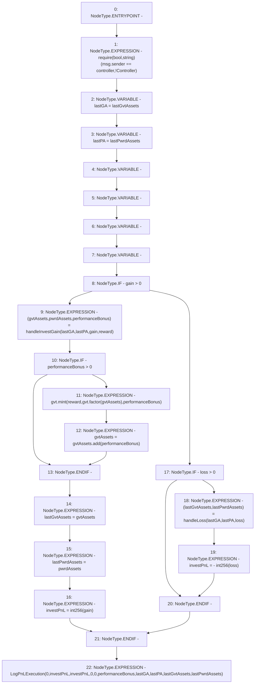

# Context: PnL.distributeStrategyGainLoss

**Contract:** `PnL` (Inherits: IPnL, FixedGTokens, Constants, Controllable, Ownable, Context)
**Signature:** `distributeStrategyGainLoss(uint256,uint256,address)`
**Method Selector ID:** `0x9ecf47c1`
**Visibility:** `external`
**Environment-Free:** `No (reads EVM state context)`
**Modifiers:** None

### State Variables Interaction
- **Reads:** controller, gvt, lastGvtAssets, lastPwrdAssets
- **Writes:** lastGvtAssets, lastPwrdAssets

### Assertion Checks & Business Requirements
- require/assert: `require(bool,string)(msg.sender == controller,!Controller)`

### Environment & Verification Flags
- **Uses Foundry Cheatcodes:** No
- **Has Echidna Properties:** No

### Internal Calls Tree
- None

### External Calls / Value Transfers
- `IToken.HIGH_LEVEL_CALL, dest:gvt(IToken), function:mint, arguments:['reward', 'TMP_185', 'performanceBonus']  `
- `SafeMath.TMP_187(uint256) = LIBRARY_CALL, dest:SafeMath, function:SafeMath.add(uint256,uint256), arguments:['gvtAssets', 'performanceBonus'] `
- `IToken.TMP_185(uint256) = HIGH_LEVEL_CALL, dest:gvt(IToken), function:factor, arguments:['gvtAssets']  `

### Control Flow Graph (CFG)


### Source Mapping
Declared in: `certora-ac-datasets/detasets/web3bugs/dataset/web3bugs/17/contracts/pnl/PnL.sol` on lines **241** to **280**

```solidity
    function distributeStrategyGainLoss(
        uint256 gain,
        uint256 loss,
        address reward
    ) external override {
        require(msg.sender == controller, "!Controller");
        uint256 lastGA = lastGvtAssets;
        uint256 lastPA = lastPwrdAssets;
        uint256 performanceBonus;
        uint256 gvtAssets;
        uint256 pwrdAssets;
        int256 investPnL;
        if (gain > 0) {
            (gvtAssets, pwrdAssets, performanceBonus) = handleInvestGain(lastGA, lastPA, gain, reward);
            if (performanceBonus > 0) {
                gvt.mint(reward, gvt.factor(gvtAssets), performanceBonus);
                gvtAssets = gvtAssets.add(performanceBonus);
            }

            lastGvtAssets = gvtAssets;
            lastPwrdAssets = pwrdAssets;
            investPnL = int256(gain);
        } else if (loss > 0) {
            (lastGvtAssets, lastPwrdAssets) = handleLoss(lastGA, lastPA, loss);
            investPnL = -int256(loss);
        }

        emit LogPnLExecution(
            0,
            investPnL,
            investPnL,
            0,
            0,
            performanceBonus,
            lastGA,
            lastPA,
            lastGvtAssets,
            lastPwrdAssets
        );
    }

```
