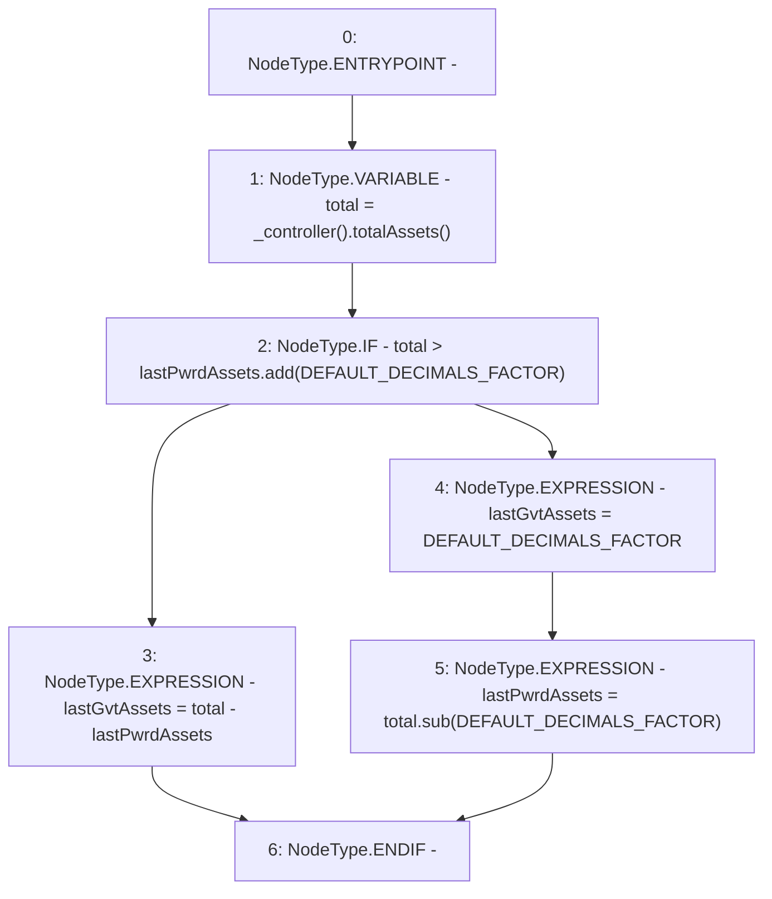

# Context: PnL.forceDistribute

**Contract:** `PnL` (Inherits: IPnL, FixedGTokens, Constants, Controllable, Ownable, Context)
**Signature:** `forceDistribute()`
**Method Selector ID:** `Internal (No Method ID)`
**Visibility:** `private`
**Environment-Free:** `Yes`
**Modifiers:** None

### State Variables Interaction
- **Reads:** DEFAULT_DECIMALS_FACTOR, lastPwrdAssets
- **Writes:** lastGvtAssets, lastPwrdAssets

### Environment & Verification Flags
- **Uses Foundry Cheatcodes:** No
- **Has Echidna Properties:** No

### Internal Calls Tree
- None

### External Calls / Value Transfers
- `SafeMath.TMP_177(uint256) = LIBRARY_CALL, dest:SafeMath, function:SafeMath.add(uint256,uint256), arguments:['lastPwrdAssets', 'DEFAULT_DECIMALS_FACTOR'] `
- `SafeMath.TMP_180(uint256) = LIBRARY_CALL, dest:SafeMath, function:SafeMath.sub(uint256,uint256), arguments:['total', 'DEFAULT_DECIMALS_FACTOR'] `
- `IController.TMP_176(uint256) = HIGH_LEVEL_CALL, dest:TMP_175(IController), function:totalAssets, arguments:[]  `

### Control Flow Graph (CFG)


### Source Mapping
Declared in: `certora-ac-datasets/detasets/web3bugs/dataset/web3bugs/17/contracts/pnl/PnL.sol` on lines **230** to **239**

```solidity
    function forceDistribute() private {
        uint256 total = _controller().totalAssets();

        if (total > lastPwrdAssets.add(DEFAULT_DECIMALS_FACTOR)) {
            lastGvtAssets = total - lastPwrdAssets;
        } else {
            lastGvtAssets = DEFAULT_DECIMALS_FACTOR;
            lastPwrdAssets = total.sub(DEFAULT_DECIMALS_FACTOR);
        }
    }

```
