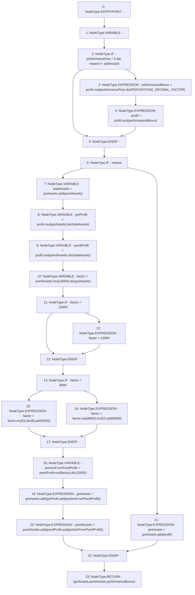

# Context: PnL.handleInvestGain

**Contract:** `PnL` (Inherits: IPnL, FixedGTokens, Constants, Controllable, Ownable, Context)
**Signature:** `handleInvestGain(uint256,uint256,uint256,address) returns (uint256, uint256, uint256)`
**Method Selector ID:** `Internal (No Method ID)`
**Visibility:** `private`
**Environment-Free:** `Yes`
**Modifiers:** None

### State Variables Interaction
- **Reads:** PERCENTAGE_DECIMAL_FACTOR, performanceFee, rebase
- **Writes:** None

### Environment & Verification Flags
- **Uses Foundry Cheatcodes:** No
- **Has Echidna Properties:** No

### Internal Calls Tree
- None

### External Calls / Value Transfers
- `SafeMath.TMP_152(uint256) = LIBRARY_CALL, dest:SafeMath, function:SafeMath.div(uint256,uint256), arguments:['TMP_151', 'totalAssets'] `
- `SafeMath.TMP_158(uint256) = LIBRARY_CALL, dest:SafeMath, function:SafeMath.div(uint256,uint256), arguments:['TMP_157', '8'] `
- `SafeMath.TMP_147(uint256) = LIBRARY_CALL, dest:SafeMath, function:SafeMath.sub(uint256,uint256), arguments:['profit', 'performanceBonus'] `
- `SafeMath.TMP_154(uint256) = LIBRARY_CALL, dest:SafeMath, function:SafeMath.div(uint256,uint256), arguments:['TMP_153', 'gvtAssets'] `
- `SafeMath.TMP_148(uint256) = LIBRARY_CALL, dest:SafeMath, function:SafeMath.add(uint256,uint256), arguments:['gvtAssets', 'pwrdAssets'] `
- `SafeMath.TMP_153(uint256) = LIBRARY_CALL, dest:SafeMath, function:SafeMath.mul(uint256,uint256), arguments:['pwrdAssets', '10000'] `
- `SafeMath.TMP_159(uint256) = LIBRARY_CALL, dest:SafeMath, function:SafeMath.add(uint256,uint256), arguments:['TMP_158', '3000'] `
- `SafeMath.TMP_169(uint256) = LIBRARY_CALL, dest:SafeMath, function:SafeMath.add(uint256,uint256), arguments:['gvtAssets', 'profit'] `
- `SafeMath.TMP_161(uint256) = LIBRARY_CALL, dest:SafeMath, function:SafeMath.mul(uint256,uint256), arguments:['TMP_160', '2'] `
- `SafeMath.TMP_164(uint256) = LIBRARY_CALL, dest:SafeMath, function:SafeMath.div(uint256,uint256), arguments:['TMP_163', '10000'] `
- `SafeMath.TMP_165(uint256) = LIBRARY_CALL, dest:SafeMath, function:SafeMath.add(uint256,uint256), arguments:['gvtProfit', 'portionFromPwrdProfit'] `
- `SafeMath.TMP_145(uint256) = LIBRARY_CALL, dest:SafeMath, function:SafeMath.mul(uint256,uint256), arguments:['profit', 'performanceFee'] `
- `SafeMath.TMP_163(uint256) = LIBRARY_CALL, dest:SafeMath, function:SafeMath.mul(uint256,uint256), arguments:['pwrdProfit', 'factor'] `
- `SafeMath.TMP_167(uint256) = LIBRARY_CALL, dest:SafeMath, function:SafeMath.sub(uint256,uint256), arguments:['pwrdProfit', 'portionFromPwrdProfit'] `
- `SafeMath.TMP_168(uint256) = LIBRARY_CALL, dest:SafeMath, function:SafeMath.add(uint256,uint256), arguments:['pwrdAssets', 'TMP_167'] `
- `SafeMath.TMP_151(uint256) = LIBRARY_CALL, dest:SafeMath, function:SafeMath.mul(uint256,uint256), arguments:['profit', 'pwrdAssets'] `
- `SafeMath.TMP_162(uint256) = LIBRARY_CALL, dest:SafeMath, function:SafeMath.add(uint256,uint256), arguments:['TMP_161', '6000'] `
- `SafeMath.TMP_166(uint256) = LIBRARY_CALL, dest:SafeMath, function:SafeMath.add(uint256,uint256), arguments:['gvtAssets', 'TMP_165'] `
- `SafeMath.TMP_160(uint256) = LIBRARY_CALL, dest:SafeMath, function:SafeMath.sub(uint256,uint256), arguments:['factor', '8000'] `
- `SafeMath.TMP_150(uint256) = LIBRARY_CALL, dest:SafeMath, function:SafeMath.div(uint256,uint256), arguments:['TMP_149', 'totalAssets'] `
- `SafeMath.TMP_146(uint256) = LIBRARY_CALL, dest:SafeMath, function:SafeMath.div(uint256,uint256), arguments:['TMP_145', 'PERCENTAGE_DECIMAL_FACTOR'] `
- `SafeMath.TMP_149(uint256) = LIBRARY_CALL, dest:SafeMath, function:SafeMath.mul(uint256,uint256), arguments:['profit', 'gvtAssets'] `
- `SafeMath.TMP_157(uint256) = LIBRARY_CALL, dest:SafeMath, function:SafeMath.mul(uint256,uint256), arguments:['factor', '3'] `

### Control Flow Graph (CFG)


### Source Mapping
Declared in: `certora-ac-datasets/detasets/web3bugs/dataset/web3bugs/17/contracts/pnl/PnL.sol` on lines **170** to **209**

```solidity
    function handleInvestGain(
        uint256 gvtAssets,
        uint256 pwrdAssets,
        uint256 profit,
        address reward
    )
        private
        view
        returns (
            uint256,
            uint256,
            uint256
        )
    {
        uint256 performanceBonus;
        if (performanceFee > 0 && reward != address(0)) {
            performanceBonus = profit.mul(performanceFee).div(PERCENTAGE_DECIMAL_FACTOR);
            profit = profit.sub(performanceBonus);
        }
        if (rebase) {
            uint256 totalAssets = gvtAssets.add(pwrdAssets);
            uint256 gvtProfit = profit.mul(gvtAssets).div(totalAssets);
            uint256 pwrdProfit = profit.mul(pwrdAssets).div(totalAssets);

            uint256 factor = pwrdAssets.mul(10000).div(gvtAssets);
            if (factor > 10000) factor = 10000;
            if (factor < 8000) {
                factor = factor.mul(3).div(8).add(3000);
            } else {
                factor = factor.sub(8000).mul(2).add(6000);
            }

            uint256 portionFromPwrdProfit = pwrdProfit.mul(factor).div(10000);
            gvtAssets = gvtAssets.add(gvtProfit.add(portionFromPwrdProfit));
            pwrdAssets = pwrdAssets.add(pwrdProfit.sub(portionFromPwrdProfit));
        } else {
            gvtAssets = gvtAssets.add(profit);
        }
        return (gvtAssets, pwrdAssets, performanceBonus);
    }

```
