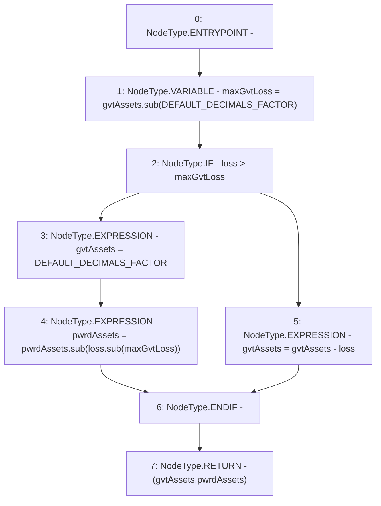

# Context: PnL.handleLoss

**Contract:** `PnL` (Inherits: IPnL, FixedGTokens, Constants, Controllable, Ownable, Context)
**Signature:** `handleLoss(uint256,uint256,uint256) returns (uint256, uint256)`
**Method Selector ID:** `Internal (No Method ID)`
**Visibility:** `private`
**Environment-Free:** `Yes`
**Modifiers:** None

### State Variables Interaction
- **Reads:** DEFAULT_DECIMALS_FACTOR
- **Writes:** None

### Environment & Verification Flags
- **Uses Foundry Cheatcodes:** No
- **Has Echidna Properties:** No

### Internal Calls Tree
- None

### External Calls / Value Transfers
- `SafeMath.TMP_172(uint256) = LIBRARY_CALL, dest:SafeMath, function:SafeMath.sub(uint256,uint256), arguments:['loss', 'maxGvtLoss'] `
- `SafeMath.TMP_170(uint256) = LIBRARY_CALL, dest:SafeMath, function:SafeMath.sub(uint256,uint256), arguments:['gvtAssets', 'DEFAULT_DECIMALS_FACTOR'] `
- `SafeMath.TMP_173(uint256) = LIBRARY_CALL, dest:SafeMath, function:SafeMath.sub(uint256,uint256), arguments:['pwrdAssets', 'TMP_172'] `

### Control Flow Graph (CFG)


### Source Mapping
Declared in: `certora-ac-datasets/detasets/web3bugs/dataset/web3bugs/17/contracts/pnl/PnL.sol` on lines **215** to **228**

```solidity
    function handleLoss(
        uint256 gvtAssets,
        uint256 pwrdAssets,
        uint256 loss
    ) private pure returns (uint256, uint256) {
        uint256 maxGvtLoss = gvtAssets.sub(DEFAULT_DECIMALS_FACTOR);
        if (loss > maxGvtLoss) {
            gvtAssets = DEFAULT_DECIMALS_FACTOR;
            pwrdAssets = pwrdAssets.sub(loss.sub(maxGvtLoss));
        } else {
            gvtAssets = gvtAssets - loss;
        }
        return (gvtAssets, pwrdAssets);
    }

```
