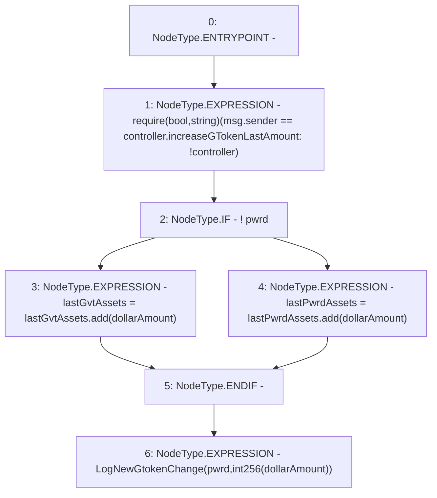

# Context: PnL.increaseGTokenLastAmount

**Contract:** `PnL` (Inherits: IPnL, FixedGTokens, Constants, Controllable, Ownable, Context)
**Signature:** `increaseGTokenLastAmount(bool,uint256)`
**Method Selector ID:** `0x7e2168c4`
**Visibility:** `external`
**Environment-Free:** `No (reads EVM state context)`
**Modifiers:** None

### State Variables Interaction
- **Reads:** controller, lastGvtAssets, lastPwrdAssets
- **Writes:** lastGvtAssets, lastPwrdAssets

### Assertion Checks & Business Requirements
- require/assert: `require(bool,string)(msg.sender == controller,increaseGTokenLastAmount: !controller)`

### Environment & Verification Flags
- **Uses Foundry Cheatcodes:** No
- **Has Echidna Properties:** No

### Internal Calls Tree
- None

### External Calls / Value Transfers
- `SafeMath.TMP_108(uint256) = LIBRARY_CALL, dest:SafeMath, function:SafeMath.add(uint256,uint256), arguments:['lastPwrdAssets', 'dollarAmount'] `
- `SafeMath.TMP_107(uint256) = LIBRARY_CALL, dest:SafeMath, function:SafeMath.add(uint256,uint256), arguments:['lastGvtAssets', 'dollarAmount'] `

### Control Flow Graph (CFG)


### Source Mapping
Declared in: `certora-ac-datasets/detasets/web3bugs/dataset/web3bugs/17/contracts/pnl/PnL.sol` on lines **98** to **106**

```solidity
    function increaseGTokenLastAmount(bool pwrd, uint256 dollarAmount) external override {
        require(msg.sender == controller, "increaseGTokenLastAmount: !controller");
        if (!pwrd) {
            lastGvtAssets = lastGvtAssets.add(dollarAmount);
        } else {
            lastPwrdAssets = lastPwrdAssets.add(dollarAmount);
        }
        emit LogNewGtokenChange(pwrd, int256(dollarAmount));
    }

```
