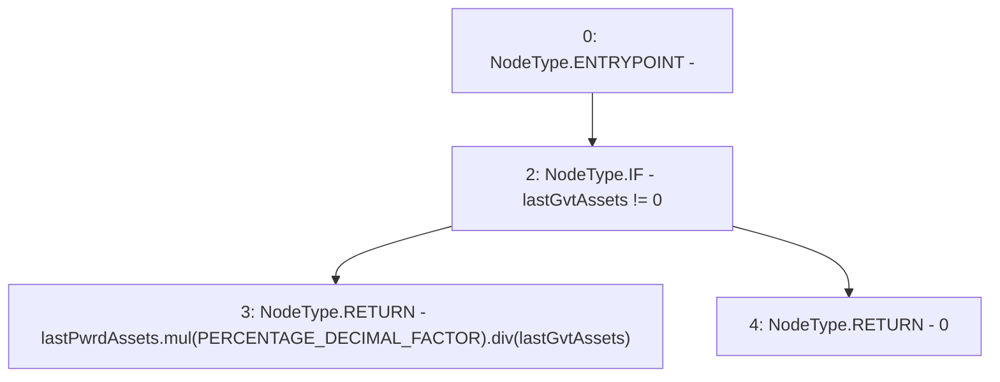

# Context: PnL.utilisationRatio

**Contract:** `PnL` (Inherits: IPnL, FixedGTokens, Constants, Controllable, Ownable, Context)
**Signature:** `utilisationRatio() returns (uint256)`
**Method Selector ID:** `0xa4723e2e`
**Visibility:** `external`
**Environment-Free:** `Yes`
**Modifiers:** None

### State Variables Interaction
- **Reads:** PERCENTAGE_DECIMAL_FACTOR, lastGvtAssets, lastPwrdAssets
- **Writes:** None

### Environment & Verification Flags
- **Uses Foundry Cheatcodes:** No
- **Has Echidna Properties:** No

### Internal Calls Tree
- None

### External Calls / Value Transfers
- `SafeMath.TMP_133(uint256) = LIBRARY_CALL, dest:SafeMath, function:SafeMath.mul(uint256,uint256), arguments:['lastPwrdAssets', 'PERCENTAGE_DECIMAL_FACTOR'] `
- `SafeMath.TMP_134(uint256) = LIBRARY_CALL, dest:SafeMath, function:SafeMath.div(uint256,uint256), arguments:['TMP_133', 'lastGvtAssets'] `

### Control Flow Graph (CFG)


### Source Mapping
Declared in: `certora-ac-datasets/detasets/web3bugs/dataset/web3bugs/17/contracts/pnl/PnL.sol` on lines **149** to **151**

```solidity
    function utilisationRatio() external view override returns (uint256) {
        return lastGvtAssets != 0 ? lastPwrdAssets.mul(PERCENTAGE_DECIMAL_FACTOR).div(lastGvtAssets) : 0;
    }

```
