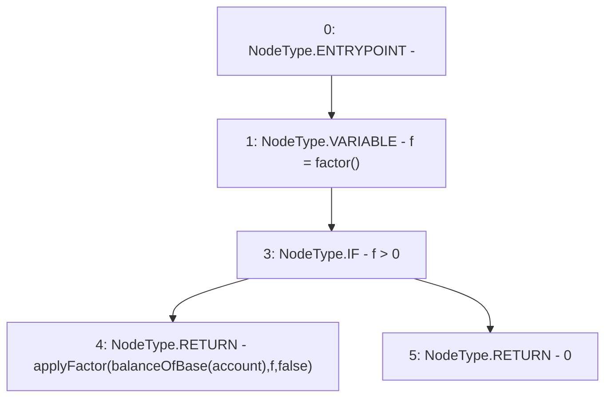

# Context: RebasingGToken.balanceOf

**Contract:** `RebasingGToken` (Inherits: GToken, IToken, Whitelist, Ownable, Constants, GERC20, IERC20, Context)
**Signature:** `balanceOf(address) returns (uint256)`
**Method Selector ID:** `0x70a08231`
**Visibility:** `public`
**Environment-Free:** `Yes`
**Modifiers:** None

### State Variables Interaction
- **Reads:** None
- **Writes:** None

### Environment & Verification Flags
- **Uses Foundry Cheatcodes:** No
- **Has Echidna Properties:** No

### Internal Calls Tree
- None

### External Calls / Value Transfers
- None

### Control Flow Graph (CFG)


### Source Mapping
Declared in: `certora-ac-datasets/detasets/web3bugs/dataset/web3bugs/17/contracts/tokens/RebasingGToken.sol` on lines **34** to **37**

```solidity
    function balanceOf(address account) public view override returns (uint256) {
        uint256 f = factor();
        return f > 0 ? applyFactor(balanceOfBase(account), f, false) : 0;
    }

```
