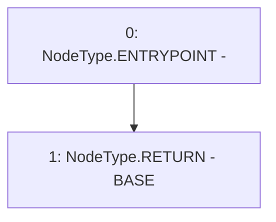

# Context: RebasingGToken.getPricePerShare

**Contract:** `RebasingGToken` (Inherits: GToken, IToken, Whitelist, Ownable, Constants, GERC20, IERC20, Context)
**Signature:** `getPricePerShare() returns (uint256)`
**Method Selector ID:** `0x3d68175c`
**Visibility:** `external`
**Environment-Free:** `Yes`
**Modifiers:** None

### State Variables Interaction
- **Reads:** BASE
- **Writes:** None

### Environment & Verification Flags
- **Uses Foundry Cheatcodes:** No
- **Has Echidna Properties:** No

### Internal Calls Tree
- None

### External Calls / Value Transfers
- None

### Control Flow Graph (CFG)


### Source Mapping
Declared in: `certora-ac-datasets/detasets/web3bugs/dataset/web3bugs/17/contracts/tokens/RebasingGToken.sol` on lines **52** to **54**

```solidity
    function getPricePerShare() external view override returns (uint256) {
        return BASE;
    }

```
