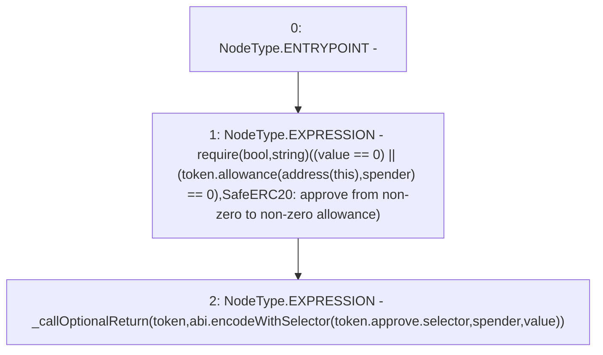

# Context: SafeERC20.safeApprove

**Contract:** `SafeERC20` (Inherits: None)
**Signature:** `safeApprove(IERC20,address,uint256)`
**Method Selector ID:** `Internal (No Method ID)`
**Visibility:** `internal`
**Environment-Free:** `Yes`
**Modifiers:** None

### State Variables Interaction
- **Reads:** None
- **Writes:** None

### Assertion Checks & Business Requirements
- require/assert: `require(bool,string)((value == 0) || (token.allowance(address(this),spender) == 0),SafeERC20: approve from non-zero to non-zero allowance)`

### Environment & Verification Flags
- **Uses Foundry Cheatcodes:** No
- **Has Echidna Properties:** No

### Internal Calls Tree
- None

### External Calls / Value Transfers
- `IERC20.TMP_293(uint256) = HIGH_LEVEL_CALL, dest:token(IERC20), function:allowance, arguments:['TMP_292', 'spender']  `

### Control Flow Graph (CFG)


### Source Mapping
Declared in: `certora-ac-datasets/detasets/web3bugs/dataset/web3bugs/17/node_modules/@openzeppelin/contracts/token/ERC20/SafeERC20.sol` on lines **37** to **46**

```solidity
    function safeApprove(IERC20 token, address spender, uint256 value) internal {
        // safeApprove should only be called when setting an initial allowance,
        // or when resetting it to zero. To increase and decrease it, use
        // 'safeIncreaseAllowance' and 'safeDecreaseAllowance'
        // solhint-disable-next-line max-line-length
        require((value == 0) || (token.allowance(address(this), spender) == 0),
            "SafeERC20: approve from non-zero to non-zero allowance"
        );
        _callOptionalReturn(token, abi.encodeWithSelector(token.approve.selector, spender, value));
    }

```
