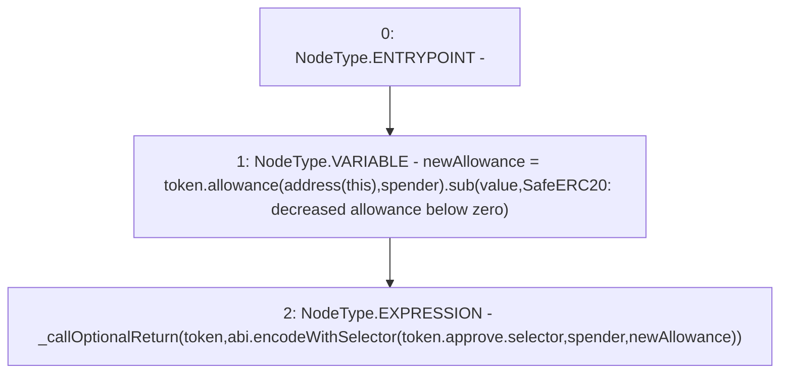

# Context: SafeERC20.safeDecreaseAllowance

**Contract:** `SafeERC20` (Inherits: None)
**Signature:** `safeDecreaseAllowance(IERC20,address,uint256)`
**Method Selector ID:** `Internal (No Method ID)`
**Visibility:** `internal`
**Environment-Free:** `Yes`
**Modifiers:** None

### State Variables Interaction
- **Reads:** None
- **Writes:** None

### Environment & Verification Flags
- **Uses Foundry Cheatcodes:** No
- **Has Echidna Properties:** No

### Internal Calls Tree
- None

### External Calls / Value Transfers
- `IERC20.TMP_305(uint256) = HIGH_LEVEL_CALL, dest:token(IERC20), function:allowance, arguments:['TMP_304', 'spender']  `
- `SafeMath.TMP_306(uint256) = LIBRARY_CALL, dest:SafeMath, function:SafeMath.sub(uint256,uint256,string), arguments:['TMP_305', 'value', 'SafeERC20: decreased allowance below zero'] `

### Control Flow Graph (CFG)


### Source Mapping
Declared in: `certora-ac-datasets/detasets/web3bugs/dataset/web3bugs/17/node_modules/@openzeppelin/contracts/token/ERC20/SafeERC20.sol` on lines **53** to **56**

```solidity
    function safeDecreaseAllowance(IERC20 token, address spender, uint256 value) internal {
        uint256 newAllowance = token.allowance(address(this), spender).sub(value, "SafeERC20: decreased allowance below zero");
        _callOptionalReturn(token, abi.encodeWithSelector(token.approve.selector, spender, newAllowance));
    }

```
