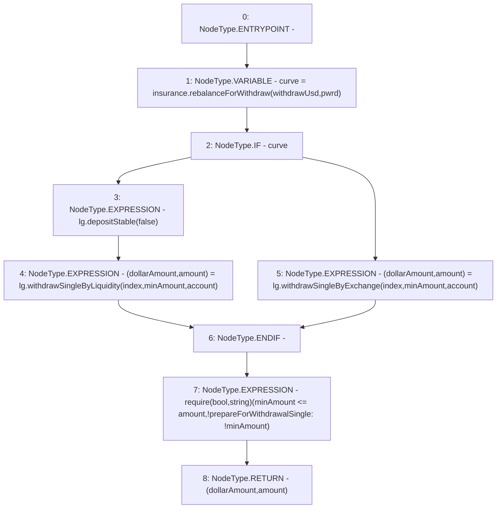

# Context: WithdrawHandler._prepareForWithdrawalSingle

**Contract:** `WithdrawHandler` (Inherits: IWithdrawHandler, FixedVaults, FixedStablecoins, Constants, Controllable, Ownable, Context)
**Signature:** `_prepareForWithdrawalSingle(address,bool,uint256,uint256,uint256) returns (uint256, uint256)`
**Method Selector ID:** `Internal (No Method ID)`
**Visibility:** `private`
**Environment-Free:** `Yes`
**Modifiers:** None

### State Variables Interaction
- **Reads:** insurance, lg
- **Writes:** None

### Assertion Checks & Business Requirements
- require/assert: `require(bool,string)(minAmount <= amount,!prepareForWithdrawalSingle: !minAmount)`

### Environment & Verification Flags
- **Uses Foundry Cheatcodes:** No
- **Has Echidna Properties:** No

### Internal Calls Tree
- None

### External Calls / Value Transfers
- `IInsurance.TMP_140(bool) = HIGH_LEVEL_CALL, dest:insurance(IInsurance), function:rebalanceForWithdraw, arguments:['withdrawUsd', 'pwrd']  `
- `ILifeGuard.TMP_141(uint256) = HIGH_LEVEL_CALL, dest:lg(ILifeGuard), function:depositStable, arguments:['False']  `
- `ILifeGuard.TUPLE_3(uint256,uint256) = HIGH_LEVEL_CALL, dest:lg(ILifeGuard), function:withdrawSingleByLiquidity, arguments:['index', 'minAmount', 'account']  `
- `ILifeGuard.TUPLE_4(uint256,uint256) = HIGH_LEVEL_CALL, dest:lg(ILifeGuard), function:withdrawSingleByExchange, arguments:['index', 'minAmount', 'account']  `

### Control Flow Graph (CFG)


### Source Mapping
Declared in: `certora-ac-datasets/detasets/web3bugs/dataset/web3bugs/17/contracts/WithdrawHandler.sol` on lines **347** to **362**

```solidity
    function _prepareForWithdrawalSingle(
        address account,
        bool pwrd,
        uint256 index,
        uint256 minAmount,
        uint256 withdrawUsd
    ) private returns (uint256 dollarAmount, uint256 amount) {
        bool curve = insurance.rebalanceForWithdraw(withdrawUsd, pwrd);
        if (curve) {
            lg.depositStable(false);
            (dollarAmount, amount) = lg.withdrawSingleByLiquidity(index, minAmount, account);
        } else {
            (dollarAmount, amount) = lg.withdrawSingleByExchange(index, minAmount, account);
        }
        require(minAmount <= amount, "!prepareForWithdrawalSingle: !minAmount");
    }

```
