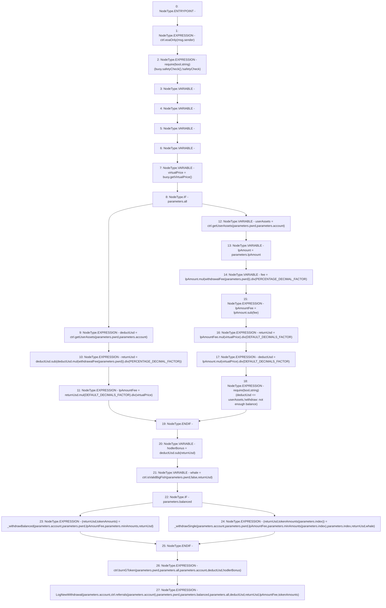

# Context: WithdrawHandler._withdraw

**Contract:** `WithdrawHandler` (Inherits: IWithdrawHandler, FixedVaults, FixedStablecoins, Constants, Controllable, Ownable, Context)
**Signature:** `_withdraw(WithdrawHandler.WithdrawParameter)`
**Method Selector ID:** `Internal (No Method ID)`
**Visibility:** `private`
**Environment-Free:** `No (reads EVM state context)`
**Modifiers:** None

### State Variables Interaction
- **Reads:** DEFAULT_DECIMALS_FACTOR, PERCENTAGE_DECIMAL_FACTOR, buoy, ctrl
- **Writes:** None

### Assertion Checks & Business Requirements
- require/assert: `require(bool,string)(buoy.safetyCheck(),!safetyCheck)`
- require/assert: `require(bool,string)(deductUsd <= userAssets,!withdraw: not enough balance)`

### Environment & Verification Flags
- **Uses Foundry Cheatcodes:** No
- **Has Echidna Properties:** No

### Internal Calls Tree
- None

### External Calls / Value Transfers
- `SafeMath.TMP_104(uint256) = LIBRARY_CALL, dest:SafeMath, function:SafeMath.sub(uint256,uint256), arguments:['lpAmount', 'fee'] `
- `SafeMath.TMP_107(uint256) = LIBRARY_CALL, dest:SafeMath, function:SafeMath.mul(uint256,uint256), arguments:['lpAmount', 'virtualPrice'] `
- `SafeMath.TMP_106(uint256) = LIBRARY_CALL, dest:SafeMath, function:SafeMath.div(uint256,uint256), arguments:['TMP_105', 'DEFAULT_DECIMALS_FACTOR'] `
- `SafeMath.TMP_103(uint256) = LIBRARY_CALL, dest:SafeMath, function:SafeMath.div(uint256,uint256), arguments:['TMP_102', 'PERCENTAGE_DECIMAL_FACTOR'] `
- `IController.TMP_93(uint256) = HIGH_LEVEL_CALL, dest:ctrl(IController), function:getUserAssets, arguments:['REF_44', 'REF_45']  `
- `SafeMath.TMP_96(uint256) = LIBRARY_CALL, dest:SafeMath, function:SafeMath.div(uint256,uint256), arguments:['TMP_95', 'PERCENTAGE_DECIMAL_FACTOR'] `
- `IController.TMP_100(uint256) = HIGH_LEVEL_CALL, dest:ctrl(IController), function:getUserAssets, arguments:['REF_53', 'REF_54']  `
- `SafeMath.TMP_105(uint256) = LIBRARY_CALL, dest:SafeMath, function:SafeMath.mul(uint256,uint256), arguments:['lpAmountFee', 'virtualPrice'] `
- `SafeMath.TMP_95(uint256) = LIBRARY_CALL, dest:SafeMath, function:SafeMath.mul(uint256,uint256), arguments:['deductUsd', 'TMP_94'] `
- `IBuoy.TMP_92(uint256) = HIGH_LEVEL_CALL, dest:buoy(IBuoy), function:getVirtualPrice, arguments:[]  `
- `SafeMath.TMP_108(uint256) = LIBRARY_CALL, dest:SafeMath, function:SafeMath.div(uint256,uint256), arguments:['TMP_107', 'DEFAULT_DECIMALS_FACTOR'] `
- `SafeMath.TMP_98(uint256) = LIBRARY_CALL, dest:SafeMath, function:SafeMath.mul(uint256,uint256), arguments:['returnUsd', 'DEFAULT_DECIMALS_FACTOR'] `
- `SafeMath.TMP_99(uint256) = LIBRARY_CALL, dest:SafeMath, function:SafeMath.div(uint256,uint256), arguments:['TMP_98', 'virtualPrice'] `
- `SafeMath.TMP_111(uint256) = LIBRARY_CALL, dest:SafeMath, function:SafeMath.sub(uint256,uint256), arguments:['deductUsd', 'returnUsd'] `
- `IController.HIGH_LEVEL_CALL, dest:ctrl(IController), function:burnGToken, arguments:['REF_80', 'REF_81', 'REF_82', 'deductUsd', 'hodlerBonus']  `
- `IBuoy.TMP_90(bool) = HIGH_LEVEL_CALL, dest:buoy(IBuoy), function:safetyCheck, arguments:[]  `
- `IController.TMP_114(address) = HIGH_LEVEL_CALL, dest:ctrl(IController), function:referrals, arguments:['REF_85']  `
- `IController.TMP_112(bool) = HIGH_LEVEL_CALL, dest:ctrl(IController), function:isValidBigFish, arguments:['REF_66', 'False', 'returnUsd']  `
- `IController.HIGH_LEVEL_CALL, dest:ctrl(IController), function:eoaOnly, arguments:['msg.sender']  `
- `SafeMath.TMP_102(uint256) = LIBRARY_CALL, dest:SafeMath, function:SafeMath.mul(uint256,uint256), arguments:['lpAmount', 'TMP_101'] `
- `SafeMath.TMP_97(uint256) = LIBRARY_CALL, dest:SafeMath, function:SafeMath.sub(uint256,uint256), arguments:['deductUsd', 'TMP_96'] `

### Control Flow Graph (CFG)


### Source Mapping
Declared in: `certora-ac-datasets/detasets/web3bugs/dataset/web3bugs/17/contracts/WithdrawHandler.sol` on lines **210** to **273**

```solidity
    function _withdraw(WithdrawParameter memory parameters) private {
        ctrl.eoaOnly(msg.sender);
        require(buoy.safetyCheck(), "!safetyCheck");

        uint256 deductUsd;
        uint256 returnUsd;
        uint256 lpAmountFee;
        uint256[N_COINS] memory tokenAmounts;
        // If it's a "withdraw all" action
        uint256 virtualPrice = buoy.getVirtualPrice();
        if (parameters.all) {
            deductUsd = ctrl.getUserAssets(parameters.pwrd, parameters.account);
            returnUsd = deductUsd.sub(deductUsd.mul(withdrawalFee(parameters.pwrd)).div(PERCENTAGE_DECIMAL_FACTOR));
            lpAmountFee = returnUsd.mul(DEFAULT_DECIMALS_FACTOR).div(virtualPrice);
            // If it's a normal withdrawal
        } else {
            uint256 userAssets = ctrl.getUserAssets(parameters.pwrd, parameters.account);
            uint256 lpAmount = parameters.lpAmount;
            uint256 fee = lpAmount.mul(withdrawalFee(parameters.pwrd)).div(PERCENTAGE_DECIMAL_FACTOR);
            lpAmountFee = lpAmount.sub(fee);
            returnUsd = lpAmountFee.mul(virtualPrice).div(DEFAULT_DECIMALS_FACTOR);
            deductUsd = lpAmount.mul(virtualPrice).div(DEFAULT_DECIMALS_FACTOR);
            require(deductUsd <= userAssets, "!withdraw: not enough balance");
        }
        uint256 hodlerBonus = deductUsd.sub(returnUsd);

        bool whale = ctrl.isValidBigFish(parameters.pwrd, false, returnUsd);

        // If it's a balanced withdrawal
        if (parameters.balanced) {
            (returnUsd, tokenAmounts) = _withdrawBalanced(
                parameters.account,
                parameters.pwrd,
                lpAmountFee,
                parameters.minAmounts,
                returnUsd
            );
            // If it's a single asset withdrawal
        } else {
            (returnUsd, tokenAmounts[parameters.index]) = _withdrawSingle(
                parameters.account,
                parameters.pwrd,
                lpAmountFee,
                parameters.minAmounts[parameters.index],
                parameters.index,
                returnUsd,
                whale
            );
        }

        ctrl.burnGToken(parameters.pwrd, parameters.all, parameters.account, deductUsd, hodlerBonus);

        emit LogNewWithdrawal(
            parameters.account,
            ctrl.referrals(parameters.account),
            parameters.pwrd,
            parameters.balanced,
            parameters.all,
            deductUsd,
            returnUsd,
            lpAmountFee,
            tokenAmounts
        );
    }

```
