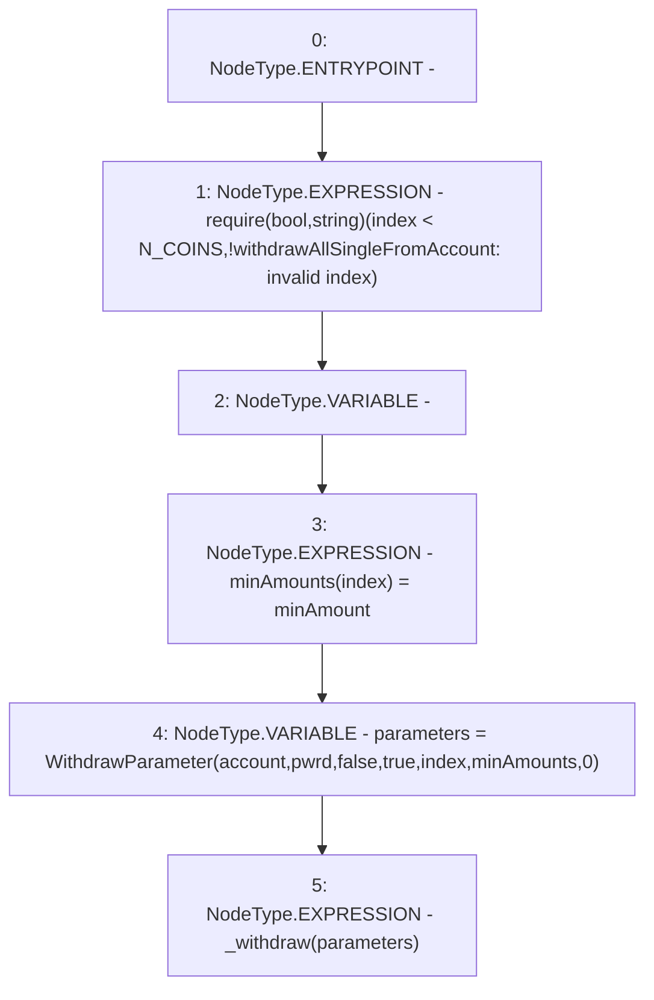

# Context: WithdrawHandler._withdrawAllSingleFromAccount

**Contract:** `WithdrawHandler` (Inherits: IWithdrawHandler, FixedVaults, FixedStablecoins, Constants, Controllable, Ownable, Context)
**Signature:** `_withdrawAllSingleFromAccount(address,bool,uint256,uint256)`
**Method Selector ID:** `Internal (No Method ID)`
**Visibility:** `private`
**Environment-Free:** `No (reads EVM state context)`
**Modifiers:** None

### State Variables Interaction
- **Reads:** N_COINS
- **Writes:** None

### Assertion Checks & Business Requirements
- require/assert: `require(bool,string)(index < N_COINS,!withdrawAllSingleFromAccount: invalid index)`

### Environment & Verification Flags
- **Uses Foundry Cheatcodes:** No
- **Has Echidna Properties:** No

### Internal Calls Tree
- None

### External Calls / Value Transfers
- None

### Control Flow Graph (CFG)


### Source Mapping
Declared in: `certora-ac-datasets/detasets/web3bugs/dataset/web3bugs/17/contracts/WithdrawHandler.sol` on lines **194** to **205**

```solidity
    function _withdrawAllSingleFromAccount(
        address account,
        bool pwrd,
        uint256 index,
        uint256 minAmount
    ) private {
        require(index < N_COINS, "!withdrawAllSingleFromAccount: invalid index");
        uint256[N_COINS] memory minAmounts;
        minAmounts[index] = minAmount;
        WithdrawParameter memory parameters = WithdrawParameter(account, pwrd, false, true, index, minAmounts, 0);
        _withdraw(parameters);
    }

```
