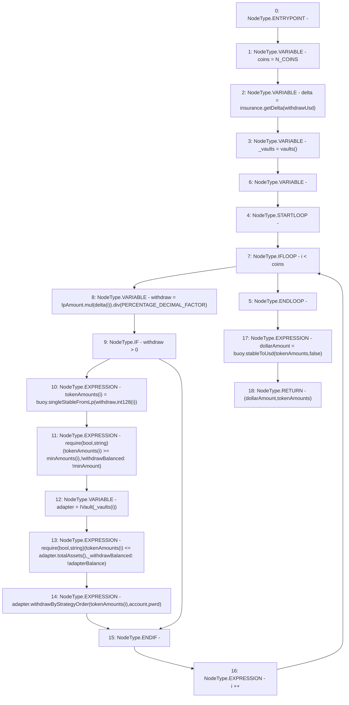

# Context: WithdrawHandler._withdrawBalanced

**Contract:** `WithdrawHandler` (Inherits: IWithdrawHandler, FixedVaults, FixedStablecoins, Constants, Controllable, Ownable, Context)
**Signature:** `_withdrawBalanced(address,bool,uint256,uint256[3],uint256) returns (uint256, uint256[3])`
**Method Selector ID:** `Internal (No Method ID)`
**Visibility:** `private`
**Environment-Free:** `Yes`
**Modifiers:** None

### State Variables Interaction
- **Reads:** N_COINS, PERCENTAGE_DECIMAL_FACTOR, buoy, insurance
- **Writes:** None

### Assertion Checks & Business Requirements
- require/assert: `require(bool,string)(tokenAmounts[i] >= minAmounts[i],!withdrawBalanced: !minAmount)`
- require/assert: `require(bool,string)(tokenAmounts[i] <= adapter.totalAssets(),_withdrawBalanced: !adapterBalance)`

### Environment & Verification Flags
- **Uses Foundry Cheatcodes:** No
- **Has Echidna Properties:** No

### Internal Calls Tree
- None

### External Calls / Value Transfers
- `SafeMath.TMP_127(uint256) = LIBRARY_CALL, dest:SafeMath, function:SafeMath.div(uint256,uint256), arguments:['TMP_126', 'PERCENTAGE_DECIMAL_FACTOR'] `
- `IBuoy.TMP_139(uint256) = HIGH_LEVEL_CALL, dest:buoy(IBuoy), function:stableToUsd, arguments:['tokenAmounts', 'False']  `
- `IBuoy.TMP_130(uint256) = HIGH_LEVEL_CALL, dest:buoy(IBuoy), function:singleStableFromLp, arguments:['withdraw', 'TMP_129']  `
- `IVault.HIGH_LEVEL_CALL, dest:adapter(IVault), function:withdrawByStrategyOrder, arguments:['REF_103', 'account', 'pwrd']  `
- `IInsurance.TMP_123(uint256[3]) = HIGH_LEVEL_CALL, dest:insurance(IInsurance), function:getDelta, arguments:['withdrawUsd']  `
- `SafeMath.TMP_126(uint256) = LIBRARY_CALL, dest:SafeMath, function:SafeMath.mul(uint256,uint256), arguments:['lpAmount', 'REF_93'] `
- `IVault.TMP_134(uint256) = HIGH_LEVEL_CALL, dest:adapter(IVault), function:totalAssets, arguments:[]  `

### Control Flow Graph (CFG)


### Source Mapping
Declared in: `certora-ac-datasets/detasets/web3bugs/dataset/web3bugs/17/contracts/WithdrawHandler.sol` on lines **316** to **337**

```solidity
    function _withdrawBalanced(
        address account,
        bool pwrd,
        uint256 lpAmount,
        uint256[N_COINS] memory minAmounts,
        uint256 withdrawUsd
    ) private returns (uint256 dollarAmount, uint256[N_COINS] memory tokenAmounts) {
        uint256 coins = N_COINS;
        uint256[N_COINS] memory delta = insurance.getDelta(withdrawUsd);
        address[N_COINS] memory _vaults = vaults();
        for (uint256 i; i < coins; i++) {
            uint256 withdraw = lpAmount.mul(delta[i]).div(PERCENTAGE_DECIMAL_FACTOR);
            if (withdraw > 0) {
                tokenAmounts[i] = buoy.singleStableFromLp(withdraw, int128(i));
                require(tokenAmounts[i] >= minAmounts[i], "!withdrawBalanced: !minAmount");
                IVault adapter = IVault(_vaults[i]);
                require(tokenAmounts[i] <= adapter.totalAssets(), "_withdrawBalanced: !adapterBalance");
                adapter.withdrawByStrategyOrder(tokenAmounts[i], account, pwrd);
            }
        }
        dollarAmount = buoy.stableToUsd(tokenAmounts, false);
    }

```
