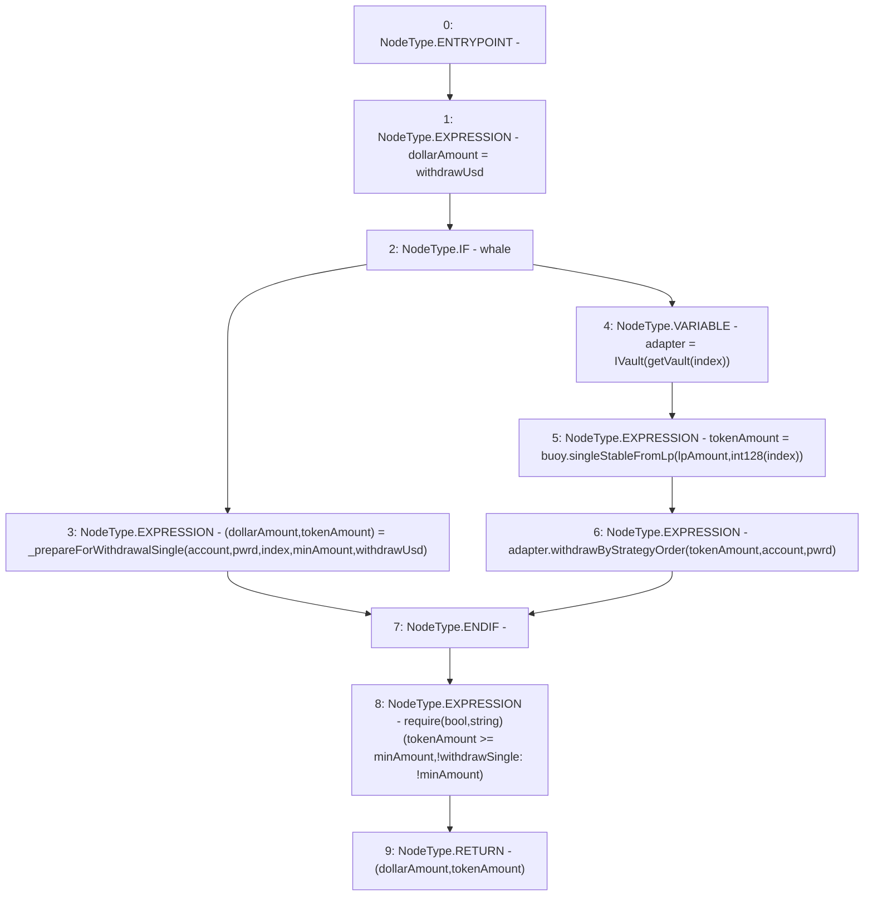

# Context: WithdrawHandler._withdrawSingle

**Contract:** `WithdrawHandler` (Inherits: IWithdrawHandler, FixedVaults, FixedStablecoins, Constants, Controllable, Ownable, Context)
**Signature:** `_withdrawSingle(address,bool,uint256,uint256,uint256,uint256,bool) returns (uint256, uint256)`
**Method Selector ID:** `Internal (No Method ID)`
**Visibility:** `private`
**Environment-Free:** `Yes`
**Modifiers:** None

### State Variables Interaction
- **Reads:** buoy
- **Writes:** None

### Assertion Checks & Business Requirements
- require/assert: `require(bool,string)(tokenAmount >= minAmount,!withdrawSingle: !minAmount)`

### Environment & Verification Flags
- **Uses Foundry Cheatcodes:** No
- **Has Echidna Properties:** No

### Internal Calls Tree
- None

### External Calls / Value Transfers
- `IBuoy.TMP_119(uint256) = HIGH_LEVEL_CALL, dest:buoy(IBuoy), function:singleStableFromLp, arguments:['lpAmount', 'TMP_118']  `
- `IVault.HIGH_LEVEL_CALL, dest:adapter(IVault), function:withdrawByStrategyOrder, arguments:['tokenAmount', 'account', 'pwrd']  `

### Control Flow Graph (CFG)


### Source Mapping
Declared in: `certora-ac-datasets/detasets/web3bugs/dataset/web3bugs/17/contracts/WithdrawHandler.sol` on lines **283** to **303**

```solidity
    function _withdrawSingle(
        address account,
        bool pwrd,
        uint256 lpAmount,
        uint256 minAmount,
        uint256 index,
        uint256 withdrawUsd,
        bool whale
    ) private returns (uint256 dollarAmount, uint256 tokenAmount) {
        dollarAmount = withdrawUsd;
        // Is the withdrawal large...
        if (whale) {
            (dollarAmount, tokenAmount) = _prepareForWithdrawalSingle(account, pwrd, index, minAmount, withdrawUsd);
        } else {
            // ... or small
            IVault adapter = IVault(getVault(index));
            tokenAmount = buoy.singleStableFromLp(lpAmount, int128(index));
            adapter.withdrawByStrategyOrder(tokenAmount, account, pwrd);
        }
        require(tokenAmount >= minAmount, "!withdrawSingle: !minAmount");
    }

```
