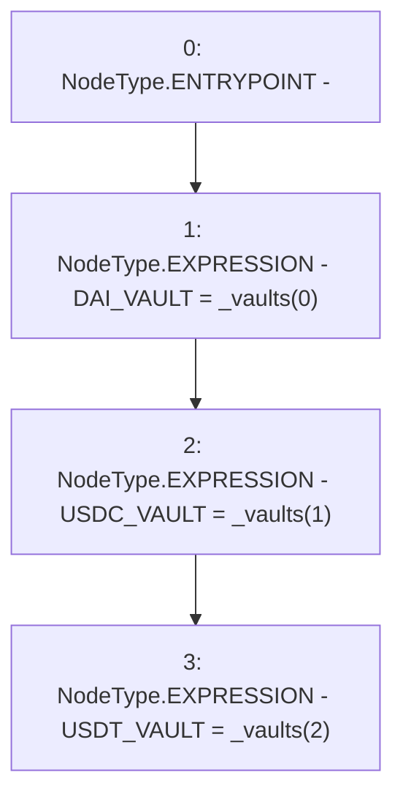

# Context: WithdrawHandler.constructor

**Contract:** `WithdrawHandler` (Inherits: IWithdrawHandler, FixedVaults, FixedStablecoins, Constants, Controllable, Ownable, Context)
**Signature:** `constructor(address[3])`
**Method Selector ID:** `0x55937de5`
**Visibility:** `public`
**Environment-Free:** `Yes`
**Modifiers:** None

### State Variables Interaction
- **Reads:** None
- **Writes:** DAI_VAULT, USDC_VAULT, USDT_VAULT

### Environment & Verification Flags
- **Uses Foundry Cheatcodes:** No
- **Has Echidna Properties:** No

### Internal Calls Tree
- None

### External Calls / Value Transfers
- None

### Control Flow Graph (CFG)


### Source Mapping
Declared in: `certora-ac-datasets/detasets/web3bugs/dataset/web3bugs/17/contracts/common/FixedContracts.sol` on lines **82** to **86**

```solidity
    constructor(address[N_COINS] memory _vaults) public {
        DAI_VAULT = _vaults[0];
        USDC_VAULT = _vaults[1];
        USDT_VAULT = _vaults[2];
    }

```
