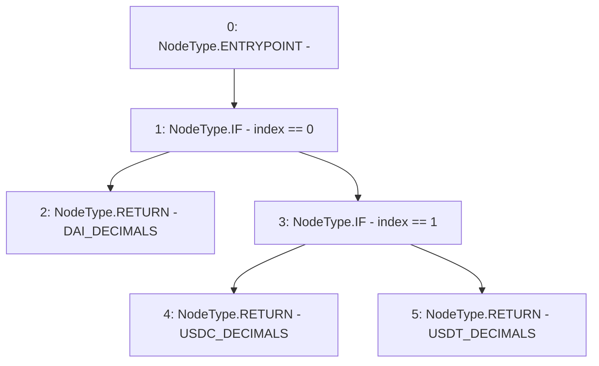

# Context: WithdrawHandler.getDecimal

**Contract:** `WithdrawHandler` (Inherits: IWithdrawHandler, FixedVaults, FixedStablecoins, Constants, Controllable, Ownable, Context)
**Signature:** `getDecimal(uint256) returns (uint256)`
**Method Selector ID:** `Internal (No Method ID)`
**Visibility:** `internal`
**Environment-Free:** `Yes`
**Modifiers:** None

### State Variables Interaction
- **Reads:** DAI_DECIMALS, USDC_DECIMALS, USDT_DECIMALS
- **Writes:** None

### Environment & Verification Flags
- **Uses Foundry Cheatcodes:** No
- **Has Echidna Properties:** No

### Internal Calls Tree
- None

### External Calls / Value Transfers
- None

### Control Flow Graph (CFG)


### Source Mapping
Declared in: `certora-ac-datasets/detasets/web3bugs/dataset/web3bugs/17/contracts/common/FixedContracts.sol` on lines **48** to **56**

```solidity
    function getDecimal(uint256 index) internal view returns (uint256) {
        if (index == 0) {
            return DAI_DECIMALS;
        } else if (index == 1) {
            return USDC_DECIMALS;
        } else {
            return USDT_DECIMALS;
        }
    }

```
