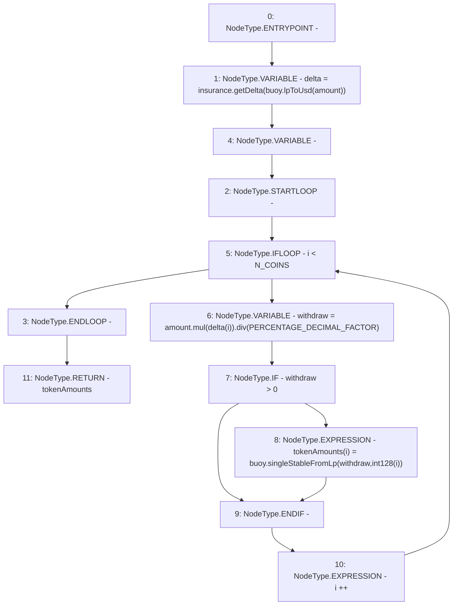

# Context: WithdrawHandler.getVaultDeltas

**Contract:** `WithdrawHandler` (Inherits: IWithdrawHandler, FixedVaults, FixedStablecoins, Constants, Controllable, Ownable, Context)
**Signature:** `getVaultDeltas(uint256) returns (uint256[3])`
**Method Selector ID:** `0x6a12a3c4`
**Visibility:** `external`
**Environment-Free:** `Yes`
**Modifiers:** None

### State Variables Interaction
- **Reads:** N_COINS, PERCENTAGE_DECIMAL_FACTOR, buoy, insurance
- **Writes:** None

### Environment & Verification Flags
- **Uses Foundry Cheatcodes:** No
- **Has Echidna Properties:** No

### Internal Calls Tree
- None

### External Calls / Value Transfers
- `SafeMath.TMP_77(uint256) = LIBRARY_CALL, dest:SafeMath, function:SafeMath.mul(uint256,uint256), arguments:['amount', 'REF_33'] `
- `IInsurance.TMP_75(uint256[3]) = HIGH_LEVEL_CALL, dest:insurance(IInsurance), function:getDelta, arguments:['TMP_74']  `
- `IBuoy.TMP_74(uint256) = HIGH_LEVEL_CALL, dest:buoy(IBuoy), function:lpToUsd, arguments:['amount']  `
- `SafeMath.TMP_78(uint256) = LIBRARY_CALL, dest:SafeMath, function:SafeMath.div(uint256,uint256), arguments:['TMP_77', 'PERCENTAGE_DECIMAL_FACTOR'] `
- `IBuoy.TMP_81(uint256) = HIGH_LEVEL_CALL, dest:buoy(IBuoy), function:singleStableFromLp, arguments:['withdraw', 'TMP_80']  `

### Control Flow Graph (CFG)


### Source Mapping
Declared in: `certora-ac-datasets/detasets/web3bugs/dataset/web3bugs/17/contracts/WithdrawHandler.sol` on lines **177** to **183**

```solidity
    function getVaultDeltas(uint256 amount) external view returns (uint256[N_COINS] memory tokenAmounts) {
        uint256[N_COINS] memory delta = insurance.getDelta(buoy.lpToUsd(amount));
        for (uint256 i; i < N_COINS; i++) {
            uint256 withdraw = amount.mul(delta[i]).div(PERCENTAGE_DECIMAL_FACTOR);
            if (withdraw > 0) tokenAmounts[i] = buoy.singleStableFromLp(withdraw, int128(i));
        }
    }

```
