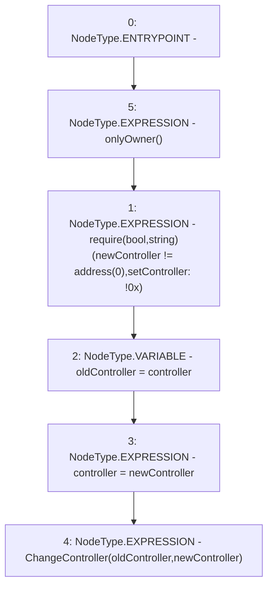

# Context: WithdrawHandler.setController

**Contract:** `WithdrawHandler` (Inherits: IWithdrawHandler, FixedVaults, FixedStablecoins, Constants, Controllable, Ownable, Context)
**Signature:** `setController(address)`
**Method Selector ID:** `0x92eefe9b`
**Visibility:** `external`
**Environment-Free:** `No (reads EVM state context)`
**Modifiers:**
- `onlyOwner`
  ```solidity
  modifier onlyOwner() {
          require(owner() == _msgSender(), "Ownable: caller is not the owner");
          _;
      }
  ```

### State Variables Interaction
- **Reads:** controller
- **Writes:** controller

### Assertion Checks & Business Requirements
- require/assert: `require(bool,string)(newController != address(0),setController: !0x)`

### Environment & Verification Flags
- **Uses Foundry Cheatcodes:** No
- **Has Echidna Properties:** No

### Internal Calls Tree
- None

### External Calls / Value Transfers
- None

### Control Flow Graph (CFG)


### Source Mapping
Declared in: `certora-ac-datasets/detasets/web3bugs/dataset/web3bugs/17/contracts/common/Controllable.sol` on lines **35** to **40**

```solidity
    function setController(address newController) external onlyOwner {
        require(newController != address(0), "setController: !0x");
        address oldController = controller;
        controller = newController;
        emit ChangeController(oldController, newController);
    }

```
