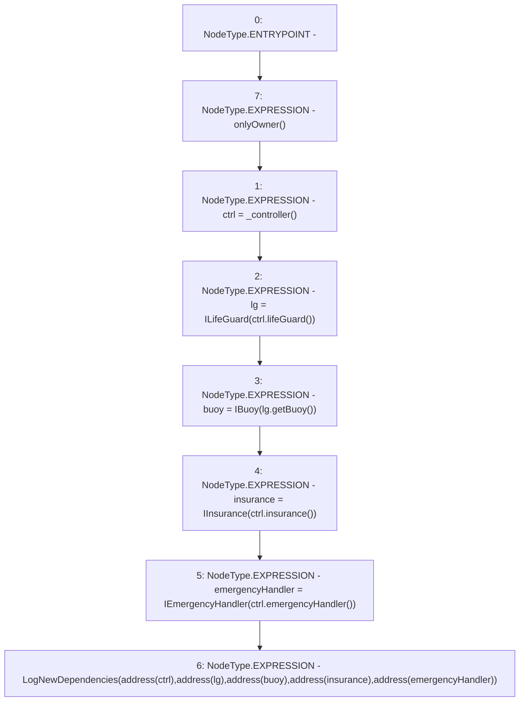

# Context: WithdrawHandler.setDependencies

**Contract:** `WithdrawHandler` (Inherits: IWithdrawHandler, FixedVaults, FixedStablecoins, Constants, Controllable, Ownable, Context)
**Signature:** `setDependencies()`
**Method Selector ID:** `0x7f185162`
**Visibility:** `external`
**Environment-Free:** `No (reads EVM state context)`
**Modifiers:**
- `onlyOwner`
  ```solidity
  modifier onlyOwner() {
          require(owner() == _msgSender(), "Ownable: caller is not the owner");
          _;
      }
  ```

### State Variables Interaction
- **Reads:** buoy, ctrl, emergencyHandler, insurance, lg
- **Writes:** buoy, ctrl, emergencyHandler, insurance, lg

### Environment & Verification Flags
- **Uses Foundry Cheatcodes:** No
- **Has Echidna Properties:** No

### Internal Calls Tree
- None

### External Calls / Value Transfers
- `IController.TMP_36(address) = HIGH_LEVEL_CALL, dest:ctrl(IController), function:lifeGuard, arguments:[]  `
- `IController.TMP_42(address) = HIGH_LEVEL_CALL, dest:ctrl(IController), function:emergencyHandler, arguments:[]  `
- `IController.TMP_40(address) = HIGH_LEVEL_CALL, dest:ctrl(IController), function:insurance, arguments:[]  `
- `ILifeGuard.TMP_38(address) = HIGH_LEVEL_CALL, dest:lg(ILifeGuard), function:getBuoy, arguments:[]  `

### Control Flow Graph (CFG)


### Source Mapping
Declared in: `certora-ac-datasets/detasets/web3bugs/dataset/web3bugs/17/contracts/WithdrawHandler.sol` on lines **75** to **88**

```solidity
    function setDependencies() external onlyOwner {
        ctrl = _controller();
        lg = ILifeGuard(ctrl.lifeGuard());
        buoy = IBuoy(lg.getBuoy());
        insurance = IInsurance(ctrl.insurance());
        emergencyHandler = IEmergencyHandler(ctrl.emergencyHandler());
        emit LogNewDependencies(
            address(ctrl),
            address(lg),
            address(buoy),
            address(insurance),
            address(emergencyHandler)
        );
    }

```
