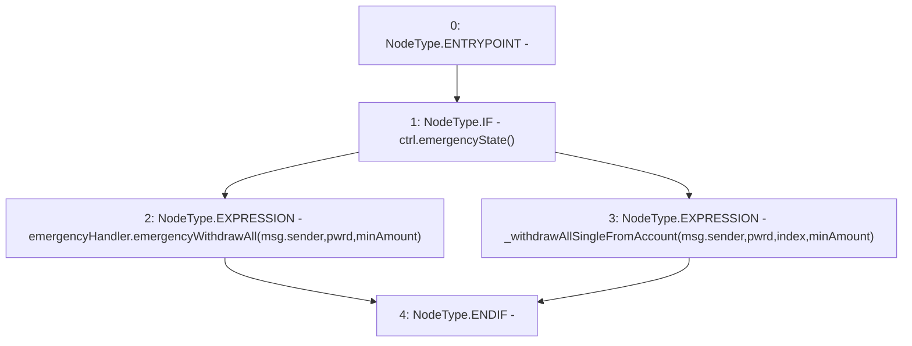

# Context: WithdrawHandler.withdrawAllSingle

**Contract:** `WithdrawHandler` (Inherits: IWithdrawHandler, FixedVaults, FixedStablecoins, Constants, Controllable, Ownable, Context)
**Signature:** `withdrawAllSingle(bool,uint256,uint256)`
**Method Selector ID:** `0x6a4a3458`
**Visibility:** `external`
**Environment-Free:** `No (reads EVM state context)`
**Modifiers:** None

### State Variables Interaction
- **Reads:** ctrl, emergencyHandler
- **Writes:** None

### Environment & Verification Flags
- **Uses Foundry Cheatcodes:** No
- **Has Echidna Properties:** No

### Internal Calls Tree
- None

### External Calls / Value Transfers
- `IController.TMP_66(bool) = HIGH_LEVEL_CALL, dest:ctrl(IController), function:emergencyState, arguments:[]  `
- `IEmergencyHandler.HIGH_LEVEL_CALL, dest:emergencyHandler(IEmergencyHandler), function:emergencyWithdrawAll, arguments:['msg.sender', 'pwrd', 'minAmount']  `

### Control Flow Graph (CFG)


### Source Mapping
Declared in: `certora-ac-datasets/detasets/web3bugs/dataset/web3bugs/17/contracts/WithdrawHandler.sol` on lines **152** to **162**

```solidity
    function withdrawAllSingle(
        bool pwrd,
        uint256 index,
        uint256 minAmount
    ) external override {
        if (ctrl.emergencyState()) {
            emergencyHandler.emergencyWithdrawAll(msg.sender, pwrd, minAmount);
        } else {
            _withdrawAllSingleFromAccount(msg.sender, pwrd, index, minAmount);
        }
    }

```
