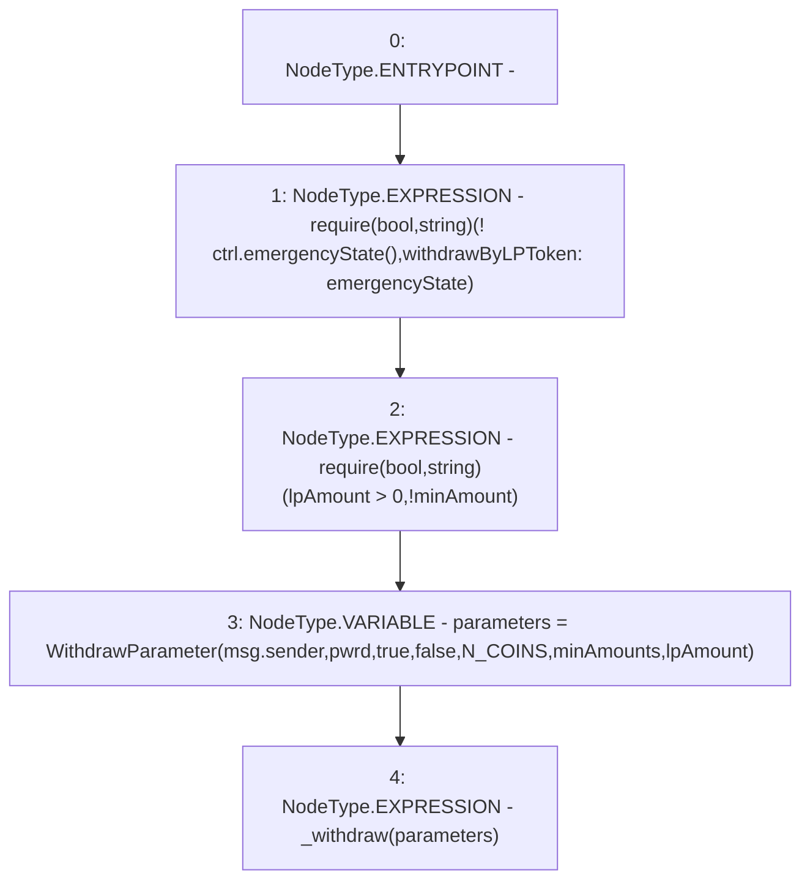

# Context: WithdrawHandler.withdrawByLPToken

**Contract:** `WithdrawHandler` (Inherits: IWithdrawHandler, FixedVaults, FixedStablecoins, Constants, Controllable, Ownable, Context)
**Signature:** `withdrawByLPToken(bool,uint256,uint256[3])`
**Method Selector ID:** `0x0c33bc5d`
**Visibility:** `external`
**Environment-Free:** `No (reads EVM state context)`
**Modifiers:** None

### State Variables Interaction
- **Reads:** N_COINS, ctrl
- **Writes:** None

### Assertion Checks & Business Requirements
- require/assert: `require(bool,string)(! ctrl.emergencyState(),withdrawByLPToken: emergencyState)`
- require/assert: `require(bool,string)(lpAmount > 0,!minAmount)`

### Environment & Verification Flags
- **Uses Foundry Cheatcodes:** No
- **Has Echidna Properties:** No

### Internal Calls Tree
- None

### External Calls / Value Transfers
- `IController.TMP_51(bool) = HIGH_LEVEL_CALL, dest:ctrl(IController), function:emergencyState, arguments:[]  `

### Control Flow Graph (CFG)


### Source Mapping
Declared in: `certora-ac-datasets/detasets/web3bugs/dataset/web3bugs/17/contracts/WithdrawHandler.sol` on lines **98** to **115**

```solidity
    function withdrawByLPToken(
        bool pwrd,
        uint256 lpAmount,
        uint256[N_COINS] calldata minAmounts
    ) external override {
        require(!ctrl.emergencyState(), "withdrawByLPToken: emergencyState");
        require(lpAmount > 0, "!minAmount");
        WithdrawParameter memory parameters = WithdrawParameter(
            msg.sender,
            pwrd,
            true,
            false,
            N_COINS,
            minAmounts,
            lpAmount
        );
        _withdraw(parameters);
    }

```
