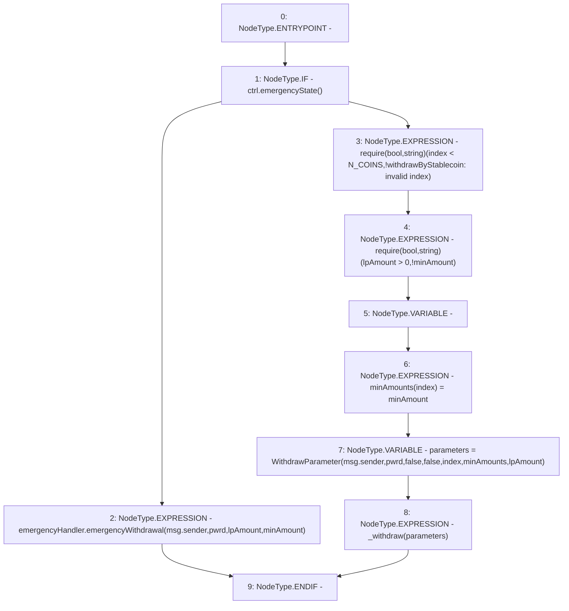

# Context: WithdrawHandler.withdrawByStablecoin

**Contract:** `WithdrawHandler` (Inherits: IWithdrawHandler, FixedVaults, FixedStablecoins, Constants, Controllable, Ownable, Context)
**Signature:** `withdrawByStablecoin(bool,uint256,uint256,uint256)`
**Method Selector ID:** `0x9793869b`
**Visibility:** `external`
**Environment-Free:** `No (reads EVM state context)`
**Modifiers:** None

### State Variables Interaction
- **Reads:** N_COINS, ctrl, emergencyHandler
- **Writes:** None

### Assertion Checks & Business Requirements
- require/assert: `require(bool,string)(index < N_COINS,!withdrawByStablecoin: invalid index)`
- require/assert: `require(bool,string)(lpAmount > 0,!minAmount)`

### Environment & Verification Flags
- **Uses Foundry Cheatcodes:** No
- **Has Echidna Properties:** No

### Internal Calls Tree
- None

### External Calls / Value Transfers
- `IController.TMP_58(bool) = HIGH_LEVEL_CALL, dest:ctrl(IController), function:emergencyState, arguments:[]  `
- `IEmergencyHandler.HIGH_LEVEL_CALL, dest:emergencyHandler(IEmergencyHandler), function:emergencyWithdrawal, arguments:['msg.sender', 'pwrd', 'lpAmount', 'minAmount']  `

### Control Flow Graph (CFG)


### Source Mapping
Declared in: `certora-ac-datasets/detasets/web3bugs/dataset/web3bugs/17/contracts/WithdrawHandler.sol` on lines **122** to **146**

```solidity
    function withdrawByStablecoin(
        bool pwrd,
        uint256 index,
        uint256 lpAmount,
        uint256 minAmount
    ) external override {
        if (ctrl.emergencyState()) {
            emergencyHandler.emergencyWithdrawal(msg.sender, pwrd, lpAmount, minAmount);
        } else {
            require(index < N_COINS, "!withdrawByStablecoin: invalid index");
            require(lpAmount > 0, "!minAmount");
            uint256[N_COINS] memory minAmounts;
            minAmounts[index] = minAmount;
            WithdrawParameter memory parameters = WithdrawParameter(
                msg.sender,
                pwrd,
                false,
                false,
                index,
                minAmounts,
                lpAmount
            );
            _withdraw(parameters);
        }
    }

```
