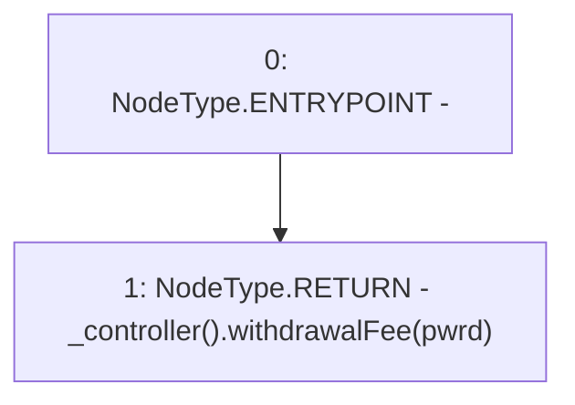

# Context: WithdrawHandler.withdrawalFee

**Contract:** `WithdrawHandler` (Inherits: IWithdrawHandler, FixedVaults, FixedStablecoins, Constants, Controllable, Ownable, Context)
**Signature:** `withdrawalFee(bool) returns (uint256)`
**Method Selector ID:** `0x50d3deaf`
**Visibility:** `public`
**Environment-Free:** `Yes`
**Modifiers:** None

### State Variables Interaction
- **Reads:** None
- **Writes:** None

### Environment & Verification Flags
- **Uses Foundry Cheatcodes:** No
- **Has Echidna Properties:** No

### Internal Calls Tree
- None

### External Calls / Value Transfers
- `IController.TMP_84(uint256) = HIGH_LEVEL_CALL, dest:TMP_83(IController), function:withdrawalFee, arguments:['pwrd']  `

### Control Flow Graph (CFG)


### Source Mapping
Declared in: `certora-ac-datasets/detasets/web3bugs/dataset/web3bugs/17/contracts/WithdrawHandler.sol` on lines **185** to **187**

```solidity
    function withdrawalFee(bool pwrd) public view returns (uint256) {
        return _controller().withdrawalFee(pwrd);
    }

```
